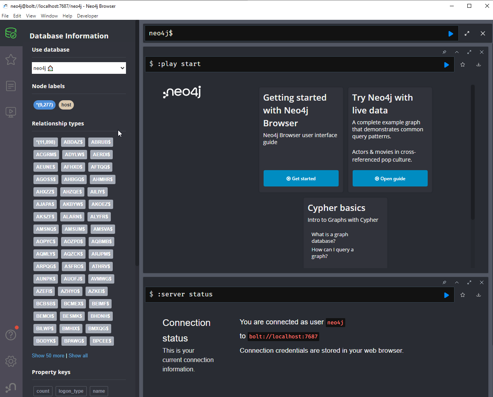
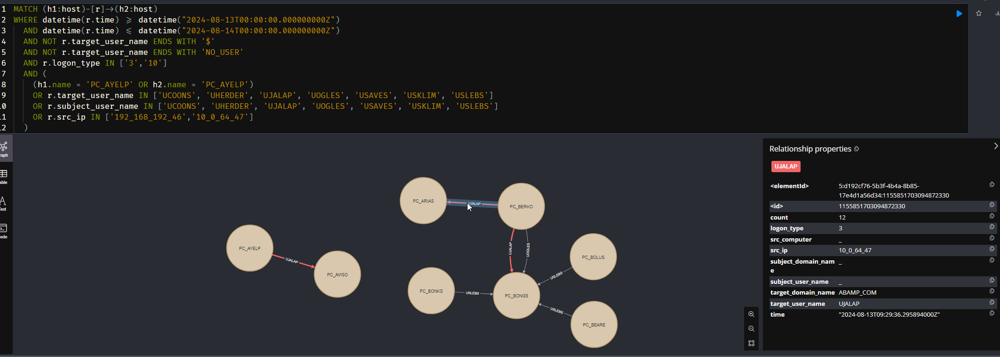

# Masstin: High-Speed DFIR Tool written in Rust and Graph Visualization in Neo4j for Comprehensive Lateral Movement Analysis

<div align="center">
  
</div>

---

**Masstin** is a Rust-written Digital Forensic and Incident Response (DFIR) tool designed to efficiently parse and analyze a wide range of forensic artifacts, with a focus on identifying lateral movement. Don't fear investigations without Security.evtx! Masstin collects over 10 different artifacts into a single timeline, initially generating a CSV file with all lateral movements unified and ordered temporally from the provided directories. You also have the option to load this data into a Neo4j database for advanced visualization and analysis using powerful Cypher queries. Ideal for DFIR analysts seeking both precision and speed, Masstin enhances your ability to uncover hidden patterns and insights from complex datasets.

## Table of Contents

- [Background](#background)
- [Key Features](#key-features)
- [Getting Started](#getting-started)
  - [Prerequisites](#prerequisites)
  - [Installation](#installation)
- [Usage](#usage)
- [Neo4j and Cypher Integration](#neo4j-and-cypher-integration)
- [Contributing](#contributing)
- [License](#license)
- [Contact](#contact)

## Background

Masstin was developed out of the need to handle incidents involving multiple machines with rotated logs, incomplete SIEM log forwarding, and limited SIEM retention. As forensic artifacts became crucial for reconstructing lateral movements across various machines, the need for efficient parsing and visualization tools became apparent.

Originally automated using a Python script (Sabonis: [https://github.com/jupyterj0nes/sabonis](https://github.com/jupyterj0nes/sabonis)), the tool evolved as more artifacts were added, eventually leading to a complete timeline representation similar to Plaso. This evolution highlighted the challenges of normalizing data, managing large volumes, and improving processing speed, especially with EVTX files over 500MB.

The shift to Rust significantly improved performance, achieving a 90% speed increase without additional preprocessing or dependencies. The result is a high-speed, reliable tool capable of processing large forensic datasets and visualizing them in Neo4j.

## Key Features

- **Parse and Load**: Efficiently parse forensic artifacts or load them into a Neo4j graph database.
- **Support for Multiple Files**: Process individual files or entire directories with high efficiency.
- **Flexible Output Options**: Save outputs to files, upload directly to Neo4j, or print to stdout for versatile usage.
- **Cross-Platform Compatibility**: Runs on both Windows and Linux without needing additional dependencies.
- **Fast Processing**: Utilizes Rust's performance to handle large forensic datasets quickly, significantly reducing processing time compared to Python-based tools.
- **Detailed Error Reporting**: Provides comprehensive error messages to aid in troubleshooting and debugging.
- **Cypher Queries**: Includes a set of pre-built Cypher queries to facilitate advanced searching and filtering during investigations.

## Getting Started

**To get started quickly, you can download the latest release directly from the [Releases page](https://github.com/jupyterj0nes/masstin/releases).**

There, you can directly download the pre-built binary for Windows (`.exe`) or Linux and run it without needing to compile from source.

### Prerequisites

Before you begin, ensure you have the following:

- **Access to a Neo4j database**: This is only required if you want to use the graphical visualization features. If you only intend to use the `parse` mode to generate and view CSV files of unified and ordered lateral movements, Neo4j is not necessary. If you do need Neo4j, you can download it from [Neo4j Download Page](https://neo4j.com/download/). You only need to create a database and choose a username and password. Masstin will communicate with the Bolt service, typically offered at `localhost:7687`. You can easily verify this setting in the database properties once Neo4j is running.

- **Rust and Cargo**: These are only necessary if you plan to compile the program from source. If you choose to use the pre-built binaries, you do not need to install Rust or Cargo. If you do need to compile from source, make sure you have the latest version of Rust and Cargo installed ([Rust Installation Guide](https://www.rust-lang.org/tools/install)).


### Installation

**To get started quickly, you can download the latest release directly from the [Releases page](https://github.com/jupyterj0nes/masstin/releases).**

On this page, you will find:
- `masstin-v0.9.0` which is the ELF binary for Linux.
- `masstin-v0.9.0.exe` which is the executable for Windows.
- A ZIP file with the source code.
- A TAR.GZ file with the source code.

Please note that Linux binaries may not work on every kernel version. If you encounter issues, you might need to compile Masstin yourself using Cargo. Instructions for building from source can be found below.

If you choose to compile the program from source, follow these steps:

1. Clone the repository and build the project:

    ```bash
    git clone https://github.com/jupyterj0nes/masstin.git
    cd masstin
    cargo build --release
    ```

    **Note:** After installing Rust, you may need to close and reopen your terminal or manually add Cargo to your PATH for the changes to take effect.

2. The executable can be found in `./target/release/`.


## Usage

Run `masstin` from the command line with the following options:

```
masstin [OPTIONS] --action <ACTION>
```

**Note**: For Windows users, just remember to use `masstin.exe` and backslashes (`\`) for paths. Linux users might find this explanation unnecessary.
 

### Example: Parsing simple Windows Logs folder

To parse a folder of Windows logs, use the following command:

#### Windows:
```
masstin.exe -a parse -d '\Velociraptor\ExtractedCollection\C\Windows\System32\winevt\Logs\' -o C:\investigation\masstin-output.csv --overwrite
```

#### Linux:
```
masstin -a parse -d '/Velociraptor/ExtractedCollection/C/Windows/System32/winevt/Logs/' -o /investigation/masstin-output.csv --overwrite
```

#### Output file example

As we can see, events from multiple different EVTX files are merged together. Typically, the initial events come from EVTX files that are not security.evtx. Due to log rotation, security.evtx files cover a limited period—often just a few days—while other EVTX files may span several years. In this example, you can observe when events from security.evtx start to appear, reflecting the rotation of logs that results in shorter log retention for security events compared to other types of logs.

```
time_created,dst_computer,event_id,subject_user_name,subject_domain_name,target_user_name,target_domain_name,logon_type,src_computer,src_ip,log_filename
2024-06-10 17:53:01.545437+00:00,PC-arias,22,,,ucronk,abamp.com,10,PC-agued,192.168.23.34,Microsoft-Windows-TerminalServices-LocalSessionManager%4Operational.evtx
2024-06-10 21:16:39.419230+00:00,PC-arias,24,,,ucronk,abamp.com,10,PC-agued,192.168.23.34,Microsoft-Windows-TerminalServices-LocalSessionManager%4Operational.evtx
2024-06-10 21:18:10.181558+00:00,PC-arias,25,,,ucronk,abamp.com,10,PC-agued,192.168.23.34,Microsoft-Windows-TerminalServices-LocalSessionManager%4Operational.evtx
2024-06-10 21:18:55.645830+00:00,PC-arias,24,,,ucronk,abamp.com,10,PC-agued,192.168.23.34,Microsoft-Windows-TerminalServices-LocalSessionManager%4Operational.evtx
2024-07-08 01:56:37.410372+00:00,PC-arias,1009,ucrudy,,,,3,PC-aedes,PC-10.10.20.23,Microsoft-Windows-SMBServer%4Security.evtx
2024-07-08 01:56:37.410374+00:00,PC-arias,551,ucrudy,,unates,,3,PC-aedes,PC-10.10.20.23,Microsoft-Windows-SMBServer%4Security.evtx
2024-07-08 01:56:38.147178+00:00,PC-arias,1009,ucrudy,,,,3,PC-aedes,PC-10.10.20.23,Microsoft-Windows-SMBServer%4Security.evtx
2024-07-08 01:56:38.147180+00:00,PC-arias,551,ucrudy,,unates,,3,PC-aedes,PC-10.10.20.23,Microsoft-Windows-SMBServer%4Security.evtx
2024-07-08 04:02:23.610180+00:00,PC-arias,1009,ucrudy,,,,3,PC-aedes,PC-10.10.20.23,Microsoft-Windows-SMBServer%4Security.evtx
2024-07-08 04:02:23.610182+00:00,PC-arias,551,ucrudy,,unates,,3,PC-aedes,PC-10.10.20.23,Microsoft-Windows-SMBServer%4Security.evtx
2024-07-08 04:02:48.529051+00:00,PC-arias,1009,ucrudy,,,,3,PC-aedes,PC-10.10.20.23,Microsoft-Windows-SMBServer%4Security.evtx
2024-07-08 04:02:48.529054+00:00,PC-arias,551,ucrudy,,unates,,3,PC-aedes,PC-10.10.20.23,Microsoft-Windows-SMBServer%4Security.evtx
2024-07-30 13:24:48.800497+00:00,PC-arias,21,,,umages,abamp.com,10,PC-amice,PC-amice,Microsoft-Windows-TerminalServices-LocalSessionManager%4Operational.evtx
2024-07-30 13:24:49.208836+00:00,PC-arias,22,,,umages,abamp.com,10,PC-amice,PC-amice,Microsoft-Windows-TerminalServices-LocalSessionManager%4Operational.evtx
2024-07-30 19:48:37.402075+00:00,PC-arias,24,,,umages,abamp.com,10,PC-amice,PC-amice,Microsoft-Windows-TerminalServices-LocalSessionManager%4Operational.evtx
2024-08-02 01:05:09.344144+00:00,PC-arias,24,,,umages,abamp.com,10,PC-amice,PC-amice,Microsoft-Windows-TerminalServices-LocalSessionManager%4Operational.evtx
2024-08-05 01:56:33.513251+00:00,PC-arias,1009,ucrudy,,,,3,PC-altos,PC-altos,Microsoft-Windows-SMBServer%4Security.evtx
2024-08-05 01:56:33.513253+00:00,PC-arias,551,ucrudy,,unates,,3,PC-altos,PC-altos,Microsoft-Windows-SMBServer%4Security.evtx
2024-08-05 01:56:33.984595+00:00,PC-arias,1009,ucrudy,,,,3,PC-altos,PC-altos,Microsoft-Windows-SMBServer%4Security.evtx
2024-08-05 04:34:58.532089+00:00,PC-arias,551,ucrudy,,unates,,3,PC-altos,PC-altos,Microsoft-Windows-SMBServer%4Security.evtx
2024-08-05 04:44:59.137856+00:00,PC-arias,1009,ucrudy,,,,3,PC-altos,PC-altos,Microsoft-Windows-SMBServer%4Security.evtx
2024-08-05 04:44:59.137859+00:00,PC-arias,551,ucrudy,,unates,,3,PC-altos,PC-altos,Microsoft-Windows-SMBServer%4Security.evtx
2024-08-05 04:45:40.590562+00:00,PC-arias,1009,ucrudy,,,,3,PC-altos,PC-altos,Microsoft-Windows-SMBServer%4Security.evtx
2024-08-05 04:45:40.590564+00:00,PC-arias,551,ucrudy,,unates,,3,PC-altos,PC-altos,Microsoft-Windows-SMBServer%4Security.evtx
2024-08-06 19:42:47.918965+00:00,PC-arias,21,,,umages,abamp.com,10,PC-amice,PC-amice,Microsoft-Windows-TerminalServices-LocalSessionManager%4Operational.evtx
2024-08-06 19:42:48.200986+00:00,PC-arias,22,,,umages,abamp.com,10,PC-amice,PC-amice,Microsoft-Windows-TerminalServices-LocalSessionManager%4Operational.evtx
2024-08-07 02:27:09.627182+00:00,PC-arias,24,,,umages,abamp.com,10,PC-amice,PC-amice,Microsoft-Windows-TerminalServices-LocalSessionManager%4Operational.evtx
2024-08-09 22:57:18.508195+00:00,PC-arias,25,,,umages,abamp.com,10,PC-amice,PC-amice,Microsoft-Windows-TerminalServices-LocalSessionManager%4Operational.evtx
2024-08-09 23:01:22.610277+00:00,PC-arias,24,,,umages,abamp.com,10,PC-amice,PC-amice,Microsoft-Windows-TerminalServices-LocalSessionManager%4Operational.evtx
2024-08-12 18:43:04.331929+00:00,PC-arias,4624,-,-,uebons,abamp.com,3,PC-audad,172.31.1.25,Security.evtx
2024-08-12 18:43:04.665159+00:00,PC-arias,4634,,,uebons,abamp.com,3,,,Security.evtx
2024-08-12 18:43:04.750419+00:00,PC-arias,4624,-,-,uebons,abamp.com,3,PC-audad,172.31.1.25,Security.evtx
2024-08-12 18:43:04.816963+00:00,PC-arias,4624,-,-,uebons,abamp.com,3,PC-audad,172.31.1.25,Security.evtx
2024-08-12 18:43:05.152701+00:00,PC-arias,4634,,,uebons,abamp.com,3,,,Security.evtx
2024-08-12 18:43:05.153298+00:00,PC-arias,4634,,,uebons,abamp.com,3,,,Security.evtx
2024-08-12 18:43:07.339480+00:00,PC-arias,4624,-,-,uebons,abamp.com,3,PC-audad,172.31.1.25,Security.evtx
2024-08-12 18:43:07.347172+00:00,PC-arias,4624,-,-,uebons,abamp.com,3,PC-audad,172.31.1.25,Security.evtx
2024-08-12 18:43:07.348558+00:00,PC-arias,4624,-,-,uebons,abamp.com,3,PC-audad,172.31.1.25,Security.evtx
2024-08-12 18:43:07.349305+00:00,PC-arias,4624,-,-,uebons,abamp.com,3,PC-audad,172.31.1.25,Security.evtx
```


### Example: Parsing multiple Windows Logs folders and singles EVTX at once

To parse a folder of Windows logs from multiple machines, as well as an archived Windows log file, use the following command:

#### Windows
```
masstin.exe -a parse -d 'machine1_image\C\Windows\System32\winevt\Logs' -d 'machine2_image\C\Windows\System32\winevt\Logs' -d 'machine3_image\C\Windows\System32\winevt\Logs' -d 'machine4_image\C\Windows\System32\winevt\Logs' -f 'path\to\single_archived_logs.evtx' -o C:\investigation\masstin-output.csv --overwrite

```

#### Linux
```
masstin -a parse -d 'machine1_image/C/Windows/System32/winevt/Logs' -d 'machine2_image/C/Windows/System32/winevt/Logs' -d 'machine3_image/C/Windows/System32/winevt/Logs' -d 'machine4_image/C/Windows/System32/winevt/Logs' -f 'path/to/single_archived_logs.evtx' -o /investigation/masstin-output.csv --overwrite
```

#### Output file example

In this example, multiple EVTX files from different machines are being merged into a single timeline. This is extremely helpful in investigations when it comes to identifying what happened and which accounts were involved within a very specific time frame.

```
time_created,dst_computer,event_id,subject_user_name,subject_domain_name,target_user_name,target_domain_name,logon_type,src_computer,src_ip,log_filename
2020-10-28 18:17:49.979945+00:00,PC-breys,21,,,ulaldy,abamp.com,10,PC-bania,10.2.23.12,Microsoft-Windows-TerminalServices-LocalSessionManager%4Operational.evtx
2020-10-28 18:17:50.239635+00:00,PC-breys,22,,,ulaldy,abamp.com,10,PC-bania,10.2.23.12,Microsoft-Windows-TerminalServices-LocalSessionManager%4Operational.evtx
2020-10-28 18:45:24.611805+00:00,PC-breys,21,,,ulaldy,abamp.com,10,PC-bania,10.2.23.12,Microsoft-Windows-TerminalServices-LocalSessionManager%4Operational.evtx
2020-10-28 18:45:24.837268+00:00,PC-breys,22,,,ulaldy,abamp.com,10,PC-bania,10.2.23.12,Microsoft-Windows-TerminalServices-LocalSessionManager%4Operational.evtx
2020-10-28 19:27:52.146888+00:00,PC-breys,21,,,ulaldy,abamp.com,10,PC-bania,10.2.23.12,Microsoft-Windows-TerminalServices-LocalSessionManager%4Operational.evtx
2020-10-28 19:27:52.423019+00:00,PC-breys,22,,,ulaldy,abamp.com,10,PC-bania,10.2.23.12,Microsoft-Windows-TerminalServices-LocalSessionManager%4Operational.evtx
2020-11-28 02:24:45.974671+00:00,PC-breys,21,,,ulaldy,abamp.com,10,PC-bania,10.2.23.12,Microsoft-Windows-TerminalServices-LocalSessionManager%4Operational.evtx
2020-11-28 02:24:46.631128+00:00,PC-breys,22,,,ulaldy,abamp.com,10,PC-bania,10.2.23.12,Microsoft-Windows-TerminalServices-LocalSessionManager%4Operational.evtx
2020-11-28 02:29:26.895803+00:00,PC-bezil,30804,,,,,3,PC-arias,10.2.23.8,Microsoft-Windows-SmbClient%4Connectivity.evtx
2020-11-28 02:29:26.895941+00:00,PC-bezil,30805,,,,,3,PC-arias,10.2.23.8,Microsoft-Windows-SmbClient%4Connectivity.evtx
2020-11-28 02:29:26.895945+00:00,PC-antre,30807,,,,,3,PC-arias,10.2.23.8,Microsoft-Windows-SmbClient%4Connectivity.evtx
2020-11-28 02:29:26.895981+00:00,PC-buats,30804,,,,,3,PC-arias,10.2.23.8,Microsoft-Windows-SmbClient%4Connectivity.evtx
2020-11-28 02:29:26.895987+00:00,PC-buats,30805,,,,,3,PC-arias,10.2.23.8,Microsoft-Windows-SmbClient%4Connectivity.evtx
2020-11-28 02:29:26.895988+00:00,PC-algin,30807,,,,,3,PC-arias,10.2.23.8,Microsoft-Windows-SmbClient%4Connectivity.evtx
2020-11-28 02:29:38.117348+00:00,PC-arias,21,,,ulaldy,abamp.com,10,PC-bania,10.2.23.12,Microsoft-Windows-TerminalServices-LocalSessionManager%4Operational.evtx
2020-11-28 02:29:38.392536+00:00,PC-arias,22,,,ulaldy,abamp.com,10,PC-bania,10.2.23.12,Microsoft-Windows-TerminalServices-LocalSessionManager%4Operational.evtx
2020-11-28 02:31:28.457567+00:00,PC-arias,21,,,ulaldy,abamp.com,10,PC-bania,10.2.23.12,Microsoft-Windows-TerminalServices-LocalSessionManager%4Operational.evtx
2020-11-28 02:31:28.701927+00:00,PC-arias,22,,,ulaldy,abamp.com,10,PC-bania,10.2.23.12,Microsoft-Windows-TerminalServices-LocalSessionManager%4Operational.evtx
2020-11-28 02:39:37.394987+00:00,PC-arias,21,,,ulaldy,abamp.com,10,PC-bania,10.2.23.12,Microsoft-Windows-TerminalServices-LocalSessionManager%4Operational.evtx
2020-11-28 02:39:37.650984+00:00,PC-arias,22,,,ulaldy,abamp.com,10,PC-bania,10.2.23.12,Microsoft-Windows-TerminalServices-LocalSessionManager%4Operational.evtx
2020-11-28 02:50:59.155238+00:00,PC-arias,24,,,ulaldy,abamp.com,10,PC-bania,10.2.23.12,Microsoft-Windows-TerminalServices-LocalSessionManager%4Operational.evtx
2020-11-28 02:51:00.327632+00:00,PC-arias,25,,,ulaldy,abamp.com,10,PC-basts,192.168.23.34,Microsoft-Windows-TerminalServices-LocalSessionManager%4Operational.evtx
2020-11-28 23:56:48.582896+00:00,PC-arias,24,,,ulaldy,abamp.com,10,PC-basts,192.168.23.34,Microsoft-Windows-TerminalServices-LocalSessionManager%4Operational.evtx
2020-11-30 08:16:27.168203+00:00,PC-arias,551,ucrudy,,,,3,PC-bucks,10.2.23.99,Microsoft-Windows-SMBServer%4Security.evtx
2020-11-30 08:16:27.171364+00:00,PC-arias,551,ucrudy,,,,3,PC-bucks,10.2.23.99,Microsoft-Windows-SMBServer%4Security.evtx
2020-12-02 11:01:27.532930+00:00,PC-arias,551,ucrudy,,,,3,PC-bucks,10.2.23.99,Microsoft-Windows-SMBServer%4Security.evtx
2020-12-02 11:01:27.534189+00:00,PC-arias,551,ucrudy,,,,3,PC-bucks,10.2.23.99,Microsoft-Windows-SMBServer%4Security.evtx
2020-12-02 19:53:11.546058+00:00,PC-arias,21,,,uduros,abamp.com,10,PC-bitos,172.10.23.32,Microsoft-Windows-TerminalServices-LocalSessionManager%4Operational.evtx
2020-12-02 19:53:11.868937+00:00,PC-arias,22,,,uduros,abamp.com,10,PC-bitos,172.10.23.32,Microsoft-Windows-TerminalServices-LocalSessionManager%4Operational.evtx
2020-12-02 19:58:17.653812+00:00,PC-arias,21,,,uminis,abamp.com,10,PC-bezes,10.2.23.55,Microsoft-Windows-TerminalServices-LocalSessionManager%4Operational.evtx
2020-12-02 19:58:17.980578+00:00,PC-arias,22,,,uminis,abamp.com,10,PC-bezes,10.2.23.55,Microsoft-Windows-TerminalServices-LocalSessionManager%4Operational.evtx
2020-12-02 21:03:39.690134+00:00,PC-arias,24,,,uduros,abamp.com,10,PC-bitos,172.10.23.32,Microsoft-Windows-TerminalServices-LocalSessionManager%4Operational.evtx
2020-12-03 03:36:03.896190+00:00,PC-arias,24,,,uminis,abamp.com,10,PC-bezes,10.2.23.55,Microsoft-Windows-TerminalServices-LocalSessionManager%4Operational.evtx
2020-12-05 20:58:14.319364+00:00,PC-arias,551,ucrudy,,,,3,PC-bucks,10.2.23.99,Microsoft-Windows-SMBServer%4Security.evtx
2020-12-05 20:58:14.322492+00:00,PC-arias,551,ucrudy,,,,3,PC-bucks,10.2.23.99,Microsoft-Windows-SMBServer%4Security.evtx
2020-12-06 08:01:28.263622+00:00,PC-acros,30804,,,,,3,PC-arias,10.2.23.8,Microsoft-Windows-SmbClient%4Connectivity.evtx
2020-12-06 08:01:28.263714+00:00,PC-acros,30804,,,,,3,PC-arias,10.2.23.8,Microsoft-Windows-SmbClient%4Connectivity.evtx
2020-12-06 08:01:28.264039+00:00,PC-acros,30804,,,,,3,PC-arias,10.2.23.8,Microsoft-Windows-SmbClient%4Connectivity.evtx
2020-12-06 08:01:28.264054+00:00,PC-acros,30804,,,,,3,PC-arias,10.2.23.8,Microsoft-Windows-SmbClient%4Connectivity.evtx
2020-12-06 08:01:28.264057+00:00,PC-acros,30805,,,,,3,PC-arias,10.2.23.8,Microsoft-Windows-SmbClient%4Connectivity.evtx
2020-12-06 08:01:28.264060+00:00,PC-ashes,30807,,,,,3,PC-arias,10.2.23.8,Microsoft-Windows-SmbClient%4Connectivity.evtx
```


### Example: Loading Data into Neo4j

To load the previously parsed data into a Neo4j database, use the following command:


#### Windows
```
masstin.exe -a load -f C:\investigation\masstin-output.csv --database localhost:7687 --user neo4j
```

#### Linux
```
masstin -a load -f /investigation/masstin-output.csv --database localhost:7687 --user neo4j
```

Note: After running the command, you will be prompted to enter the password for the Neo4j database.

#### Output

After executing the command, you will be prompted to enter your password. If everything goes smoothly, you will see a complete list of IP address assignments to hostnames and their frequencies, followed by a progress bar.

As events are loaded into the database, the tool will display all automatic resolutions to assist the analyst.

**What are these automatic resolutions?**

Masstin handles a large volume of logs where sometimes only the hostname is available, only the IP address is available, or occasionally both are provided.

The tool leverages logs where both hostname and IP address are present to register them along with their frequency.

When inserting data into the Neo4j database, it is crucial that the hostname field is never empty. Therefore, for logs where only the IP address is provided, the tool automatically resolves the hostname based on the previously observed frequency.

It is important to note that there may be some inaccuracies, so always consult the original CSV for verification if in doubt.

Additionally, for connections with the same source, destination, user, and logon type, the tool groups these connections to reduce noise and prevent excessive resource consumption in the graph database. The date is set to the first occurrence, and a count of occurrences is added. As you work more with Neo4j and Masstin, you will find that without this grouping, managing graph databases would be nearly impossible.


```
PS C:\Tools\masstin> .\target\release\masstin.exe -a load -f C:\cases\merged_anon.csv --database localhost:7687 -u neo4j
MASSTIN - Enter Neo4j database password:
("172.31.3.105", "PC-ADITS") has 23 occurrences
("172.19.61.70", "PC-BAFTS") has 31 occurrences
("172.31.3.32", "PC-ANISE") has 70 occurrences
("172.18.44.75", "PC-AMAIN") has 26 occurrences
("172.31.23.60", "PC-ARCOS") has 1579 occurrences
("172.31.31.153", "PC-ATUAS") has 227 occurrences
("10.136.9.5", "PC-APAGE") has 25 occurrences
("10.200.1.8", "PC-BARNY") has 32 occurrences
("172.31.11.102", "PC-ADIEU") has 273 occurrences
("10.0.18.65", "PC-APERS") has 18 occurrences
("172.31.1.29", "PC-BEZZY") has 30728 occurrences
("10.200.0.35", "PC-AMOUR") has 27 occurrences
("172.31.3.239", "PC-AIRER") has 39 occurrences
("172.19.56.235", "PC-APPUY") has 19 occurrences
("172.18.45.95", "PC-AYRIE") has 28 occurrences
("172.31.3.14", "PC-BONED") has 49 occurrences
("10.200.0.251", "PC-AREDE") has 26 occurrences
("172.19.41.136", "PC-ABORD") has 19 occurrences
("172.31.3.144", "PC-BLAWS") has 76 occurrences
("172.31.4.33", "PC-ATUAS") has 305 occurrences
("172.31.1.177", "PC-BAWRS") has 1538 occurrences
("10.200.3.4", "PC-ANENT") has 21 occurrences
("10.200.3.0", "PC-APERY") has 18 occurrences
("10.200.2.23", "PC-BARES") has 33 occurrences
("10.200.2.32", "PC-ALANE") has 25 occurrences
("172.31.3.91", "PC-BONKS") has 61 occurrences
("172.31.3.231", "PC-ANSAE") has 42 occurrences
("172.31.1.176", "PC-BARDY") has 224 occurrences
("10.200.1.2", "PC-BITOU") has 18 occurrences
("172.31.3.166", "PC-ABEAR") has 23 occurrences
("172.31.3.100", "PC-AZOTH") has 76 occurrences
("10.200.1.32", "PC-BOURG") has 24 occurrences
("172.31.3.227", "PC-BOLUS") has 38 occurrences
("172.31.3.115", "PC-BLOGS") has 72 occurrences
("172.31.3.141", "PC-BUBBA") has 93 occurrences
("172.19.85.72", "PC-ARIKI") has 26 occurrences
("172.31.1.25", "PC-AUDAD") has 16160 occurrences
("10.0.61.89", "PC-BAJAN") has 47 occurrences
("172.18.104.53", "PC-ARNUT") has 374 occurrences
("10.200.3.31", "PC-BEANS") has 37 occurrences
("172.31.3.26", "PC-BASTA") has 63 occurrences
("10.216.52.31", "PC-ARMER") has 19 occurrences
("172.19.37.48", "PC-BECAP") has 18 occurrences
("172.19.33.42", "PC-AXELS") has 19 occurrences
("10.200.0.44", "PC-BIRSE") has 202 occurrences
("172.19.104.38", "PC-BREES") has 19 occurrences
("172.31.3.148", "PC-ALECS") has 31 occurrences
("172.31.3.88", "PC-BEARE") has 36 occurrences
("10.153.113.71", "PC-BABOO") has 22 occurrences
("172.31.3.179", "PC-ASTIR") has 27 occurrences
("10.200.2.22", "PC-ADDAX") has 24 occurrences
("172.31.3.235", "PC-BUFFO") has 84 occurrences
("10.216.49.63", "PC-BERKS") has 28 occurrences
("172.31.3.233", "PC-AGLOO") has 33 occurrences
("10.200.3.23", "PC-ALANT") has 18 occurrences
("10.200.3.29", "PC-BILBO") has 31 occurrences
("172.31.20.14", "PC-ATUAS") has 2446 occurrences
("10.200.0.52", "PC-ALMES") has 30 occurrences
("10.200.3.26", "PC-ADBOT") has 22 occurrences
("172.31.3.16", "PC-AMMAN") has 82 occurrences
("172.19.33.41", "PC-ALLIS") has 29 occurrences
("10.216.18.71", "PC-AVOWS") has 32 occurrences
("172.19.121.57", "PC-ABAMP") has 20 occurrences
("10.200.2.254", "PC-BENTS") has 32 occurrences
("172.18.44.70", "PC-AIZLE") has 28 occurrences
░░░░░░░░░░░░░░░░░░░░░░░░░░░░░░░░░░░░░░░░░░░░░░░░░░░░░░░░░░░░░░░░░░░░░░░░░░░░░░░░░░░░░░░░░░░░░░░░░░░░░░░░░░░░░░░░░░░░░░░░░░░░░░░░░░░░░░░░░░░░░░░░░░░░░░░░░░░░░░░░░░░░░░░░░░░░░░░░░░░░░░░░░░░░░░░░░░░░░░░░░░░░░░░░░░░░░░░░░░░░░░░░░░░░░░░░░░░░░░░░░░░░░░░░░░░░░░░░░░░░░░░░░░░░░░░░░ 9/11898
MASSTIN: IP 10.152.5.7 has been resolved to hostname: PC-AMYLS as it has been seen 1 times.
░░░░░░░░░░░░░░░░░░░░░░░░░░░░░░░░░░░░░░░░░░░░░░░░░░░░░░░░░░░░░░░░░░░░░░░░░░░░░░░░░░░░░░░░░░░░░░░░░░░░░░░░░░░░░░░░░░░░░░░░░░░░░░░░░░░░░░░░░░░░░░░░░░░░░░░░░░░░░░░░░░░░░░░░░░░░░░░░░░░░░░░░░░░░░░░░░░░░░░░░░░░░░░░░░░░░░░░░░░░░░░░░░░░░░░░░░░░░░░░░░░░░░░░░░░░░░░░░░░░░░░░░░░░░░░░░ 10/11898
MASSTIN: IP 10.200.115.31 has been resolved to hostname: PC-BRONC as it has been seen 1 times.
░░░░░░░░░░░░░░░░░░░░░░░░░░░░░░░░░░░░░░░░░░░░░░░░░░░░░░░░░░░░░░░░░░░░░░░░░░░░░░░░░░░░░░░░░░░░░░░░░░░░░░░░░░░░░░░░░░░░░░░░░░░░░░░░░░░░░░░░░░░░░░░░░░░░░░░░░░░░░░░░░░░░░░░░░░░░░░░░░░░░░░░░░░░░░░░░░░░░░░░░░░░░░░░░░░░░░░░░░░░░░░░░░░░░░░░░░░░░░░░░░░░░░░░░░░░░░░░░░░░░░░░░░░░░░░░░ 14/11898
MASSTIN: IP 10.216.18.60 has been resolved to hostname: PC-BLUNK as it has been seen 13 times.
░░░░░░░░░░░░░░░░░░░░░░░░░░░░░░░░░░░░░░░░░░░░░░░░░░░░░░░░░░░░░░░░░░░░░░░░░░░░░░░░░░░░░░░░░░░░░░░░░░░░░░░░░░░░░░░░░░░░░░░░░░░░░░░░░░░░░░░░░░░░░░░░░░░░░░░░░░░░░░░░░░░░░░░░░░░░░░░░░░░░░░░░░░░░░░░░░░░░░░░░░░░░░░░░░░░░░░░░░░░░░░░░░░░░░░░░░░░░░░░░░░░░░░░░░░░░░░░░░░░░░░░░░░░░░░░░ 18/11898
MASSTIN: IP 172.19.104.215 has been resolved to hostname: PC-ABUNE as it has been seen 1 times.
░░░░░░░░░░░░░░░░░░░░░░░░░░░░░░░░░░░░░░░░░░░░░░░░░░░░░░░░░░░░░░░░░░░░░░░░░░░░░░░░░░░░░░░░░░░░░░░░░░░░░░░░░░░░░░░░░░░░░░░░░░░░░░░░░░░░░░░░░░░░░░░░░░░░░░░░░░░░░░░░░░░░░░░░░░░░░░░░░░░░░░░░░░░░░░░░░░░░░░░░░░░░░░░░░░░░░░░░░░░░░░░░░░░░░░░░░░░░░░░░░░░░░░░░░░░░░░░░░░░░░░░░░░░░░░░░ 19/11898
MASSTIN: IP 10.216.53.38 has been resolved to hostname: PC-ALIST as it has been seen 1 times.
░░░░░░░░░░░░░░░░░░░░░░░░░░░░░░░░░░░░░░░░░░░░░░░░░░░░░░░░░░░░░░░░░░░░░░░░░░░░░░░░░░░░░░░░░░░░░░░░░░░░░░░░░░░░░░░░░░░░░░░░░░░░░░░░░░░░░░░░░░░░░░░░░░░░░░░░░░░░░░░░░░░░░░░░░░░░░░░░░░░░░░░░░░░░░░░░░░░░░░░░░░░░░░░░░░░░░░░░░░░░░░░░░░░░░░░░░░░░░░░░░░░░░░░░░░░░░░░░░░░░░░░░░░░░░░░░ 31/11898
MASSTIN: IP 172.31.3.231 has been resolved to hostname: PC-ANSAE as it has been seen 42 times.
░░░░░░░░░░░░░░░░░░░░░░░░░░░░░░░░░░░░░░░░░░░░░░░░░░░░░░░░░░░░░░░░░░░░░░░░░░░░░░░░░░░░░░░░░░░░░░░░░░░░░░░░░░░░░░░░░░░░░░░░░░░░░░░░░░░░░░░░░░░░░░░░░░░░░░░░░░░░░░░░░░░░░░░░░░░░░░░░░░░░░░░░░░░░░░░░░░░░░░░░░░░░░░░░░░░░░░░░░░░░░░░░░░░░░░░░░░░░░░░░░░░░░░░░░░░░░░░░░░░░░░░░░░░░░░░░ 32/11898
MASSTIN: IP 172.18.19.35 has been resolved to hostname: PC-AHENT as it has been seen 1 times.
░░░░░░░░░░░░░░░░░░░░░░░░░░░░░░░░░░░░░░░░░░░░░░░░░░░░░░░░░░░░░░░░░░░░░░░░░░░░░░░░░░░░░░░░░░░░░░░░░░░░░░░░░░░░░░░░░░░░░░░░░░░░░░░░░░░░░░░░░░░░░░░░░░░░░░░░░░░░░░░░░░░░░░░░░░░░░░░░░░░░░░░░░░░░░░░░░░░░░░░░░░░░░░░░░░░░░░░░░░░░░░░░░░░░░░░░░░░░░░░░░░░░░░░░░░░░░░░░░░░░░░░░░░░░░░░░ 40/11898
MASSTIN: IP 10.216.67.32 has been resolved to hostname: PC-BAELS as it has been seen 1 times.
█░░░░░░░░░░░░░░░░░░░░░░░░░░░░░░░░░░░░░░░░░░░░░░░░░░░░░░░░░░░░░░░░░░░░░░░░░░░░░░░░░░░░░░░░░░░░░░░░░░░░░░░░░░░░░░░░░░░░░░░░░░░░░░░░░░░░░░░░░░░░░░░░░░░░░░░░░░░░░░░░░░░░░░░░░░░░░░░░░░░░░░░░░░░░░░░░░░░░░░░░░░░░░░░░░░░░░░░░░░░░░░░░░░░░░░░░░░░░░░░░░░░░░░░░░░░░░░░░░░░░░░░░░░░░░░░ 48/11898
MASSTIN: IP 172.19.41.72 has been resolved to hostname: PC-BOPPY as it has been seen 1 times.
█░░░░░░░░░░░░░░░░░░░░░░░░░░░░░░░░░░░░░░░░░░░░░░░░░░░░░░░░░░░░░░░░░░░░░░░░░░░░░░░░░░░░░░░░░░░░░░░░░░░░░░░░░░░░░░░░░░░░░░░░░░░░░░░░░░░░░░░░░░░░░░░░░░░░░░░░░░░░░░░░░░░░░░░░░░░░░░░░░░░░░░░░░░░░░░░░░░░░░░░░░░░░░░░░░░░░░░░░░░░░░░░░░░░░░░░░░░░░░░░░░░░░░░░░░░░░░░░░░░░░░░░░░░░░░░░ 50/11898
MASSTIN: IP 172.19.68.46 has been resolved to hostname: PC-ATRIP as it has been seen 5 times.
█░░░░░░░░░░░░░░░░░░░░░░░░░░░░░░░░░░░░░░░░░░░░░░░░░░░░░░░░░░░░░░░░░░░░░░░░░░░░░░░░░░░░░░░░░░░░░░░░░░░░░░░░░░░░░░░░░░░░░░░░░░░░░░░░░░░░░░░░░░░░░░░░░░░░░░░░░░░░░░░░░░░░░░░░░░░░░░░░░░░░░░░░░░░░░░░░░░░░░░░░░░░░░░░░░░░░░░░░░░░░░░░░░░░░░░░░░░░░░░░░░░░░░░░░░░░░░░░░░░░░░░░░░░░░░░░ 63/11898
MASSTIN: IP 172.19.124.98 has been resolved to hostname: PC-BENET as it has been seen 2 times.
█░░░░░░░░░░░░░░░░░░░░░░░░░░░░░░░░░░░░░░░░░░░░░░░░░░░░░░░░░░░░░░░░░░░░░░░░░░░░░░░░░░░░░░░░░░░░░░░░░░░░░░░░░░░░░░░░░░░░░░░░░░░░░░░░░░░░░░░░░░░░░░░░░░░░░░░░░░░░░░░░░░░░░░░░░░░░░░░░░░░░░░░░░░░░░░░░░░░░░░░░░░░░░░░░░░░░░░░░░░░░░░░░░░░░░░░░░░░░░░░░░░░░░░░░░░░░░░░░░░░░░░░░░░░░░░░ 72/11898
MASSTIN: IP 10.152.7.15 has been resolved to hostname: PC-AWATO as it has been seen 1 times.
█░░░░░░░░░░░░░░░░░░░░░░░░░░░░░░░░░░░░░░░░░░░░░░░░░░░░░░░░░░░░░░░░░░░░░░░░░░░░░░░░░░░░░░░░░░░░░░░░░░░░░░░░░░░░░░░░░░░░░░░░░░░░░░░░░░░░░░░░░░░░░░░░░░░░░░░░░░░░░░░░░░░░░░░░░░░░░░░░░░░░░░░░░░░░░░░░░░░░░░░░░░░░░░░░░░░░░░░░░░░░░░░░░░░░░░░░░░░░░░░░░░░░░░░░░░░░░░░░░░░░░░░░░░░░░░░ 79/11898
MASSTIN: IP 10.200.0.28 has been resolved to hostname: PC-ASKED as it has been seen 5 times.
█░░░░░░░░░░░░░░░░░░░░░░░░░░░░░░░░░░░░░░░░░░░░░░░░░░░░░░░░░░░░░░░░░░░░░░░░░░░░░░░░░░░░░░░░░░░░░░░░░░░░░░░░░░░░░░░░░░░░░░░░░░░░░░░░░░░░░░░░░░░░░░░░░░░░░░░░░░░░░░░░░░░░░░░░░░░░░░░░░░░░░░░░░░░░░░░░░░░░░░░░░░░░░░░░░░░░░░░░░░░░░░░░░░░░░░░░░░░░░░░░░░░░░░░░░░░░░░░░░░░░░░░░░░░░░░░ 80/11898
MASSTIN: IP 10.200.2.43 has been resolved to hostname: PC-BANCS as it has been seen 2 times.
█░░░░░░░░░░░░░░░░░░░░░░░░░░░░░░░░░░░░░░░░░░░░░░░░░░░░░░░░░░░░░░░░░░░░░░░░░░░░░░░░░░░░░░░░░░░░░░░░░░░░░░░░░░░░░░░░░░░░░░░░░░░░░░░░░░░░░░░░░░░░░░░░░░░░░░░░░░░░░░░░░░░░░░░░░░░░░░░░░░░░░░░░░░░░░░░░░░░░░░░░░░░░░░░░░░░░░░░░░░░░░░░░░░░░░░░░░░░░░░░░░░░░░░░░░░░░░░░░░░░░░░░░░░░░░░░ 81/11898
MASSTIN: IP 10.216.67.100 has been resolved to hostname: PC-BOETS as it has been seen 4 times.
█░░░░░░░░░░░░░░░░░░░░░░░░░░░░░░░░░░░░░░░░░░░░░░░░░░░░░░░░░░░░░░░░░░░░░░░░░░░░░░░░░░░░░░░░░░░░░░░░░░░░░░░░░░░░░░░░░░░░░░░░░░░░░░░░░░░░░░░░░░░░░░░░░░░░░░░░░░░░░░░░░░░░░░░░░░░░░░░░░░░░░░░░░░░░░░░░░░░░░░░░░░░░░░░░░░░░░░░░░░░░░░░░░░░░░░░░░░░░░░░░░░░░░░░░░░░░░░░░░░░░░░░░░░░░░░░ 82/11898
MASSTIN: IP 172.19.9.27 has been resolved to hostname: PC-AXILE as it has been seen 1 times.
█░░░░░░░░░░░░░░░░░░░░░░░░░░░░░░░░░░░░░░░░░░░░░░░░░░░░░░░░░░░░░░░░░░░░░░░░░░░░░░░░░░░░░░░░░░░░░░░░░░░░░░░░░░░░░░░░░░░░░░░░░░░░░░░░░░░░░░░░░░░░░░░░░░░░░░░░░░░░░░░░░░░░░░░░░░░░░░░░░░░░░░░░░░░░░░░░░░░░░░░░░░░░░░░░░░░░░░░░░░░░░░░░░░░░░░░░░░░░░░░░░░░░░░░░░░░░░░░░░░░░░░░░░░░░░░░ 84/11898
MASSTIN: IP 10.200.2.40 has been resolved to hostname: PC-BETAS as it has been seen 2 times.
█░░░░░░░░░░░░░░░░░░░░░░░░░░░░░░░░░░░░░░░░░░░░░░░░░░░░░░░░░░░░░░░░░░░░░░░░░░░░░░░░░░░░░░░░░░░░░░░░░░░░░░░░░░░░░░░░░░░░░░░░░░░░░░░░░░░░░░░░░░░░░░░░░░░░░░░░░░░░░░░░░░░░░░░░░░░░░░░░░░░░░░░░░░░░░░░░░░░░░░░░░░░░░░░░░░░░░░░░░░░░░░░░░░░░░░░░░░░░░░░░░░░░░░░░░░░░░░░░░░░░░░░░░░░░░░░ 86/11898
MASSTIN: IP 172.31.30.152 has been resolved to hostname: PC-ARHAT as it has been seen 2 times.
██░░░░░░░░░░░░░░░░░░░░░░░░░░░░░░░░░░░░░░░░░░░░░░░░░░░░░░░░░░░░░░░░░░░░░░░░░░░░░░░░░░░░░░░░░░░░░░░░░░░░░░░░░░░░░░░░░░░░░░░░░░░░░░░░░░░░░░░░░░░░░░░░░░░░░░░░░░░░░░░░░░░░░░░░░░░░░░░░░░░░░░░░░░░░░░░░░░░░░░░░░░░░░░░░░░░░░░░░░░░░░░░░░░░░░░░░░░░░░░░░░░░░░░░░░░░░░░░░░░░░░░░░░░░░░░ 92/11898
MASSTIN: IP 192.168.208.204 has been resolved to hostname: PC-BAITS as it has been seen 6 times.
██░░░░░░░░░░░░░░░░░░░░░░░░░░░░░░░░░░░░░░░░░░░░░░░░░░░░░░░░░░░░░░░░░░░░░░░░░░░░░░░░░░░░░░░░░░░░░░░░░░░░░░░░░░░░░░░░░░░░░░░░░░░░░░░░░░░░░░░░░░░░░░░░░░░░░░░░░░░░░░░░░░░░░░░░░░░░░░░░░░░░░░░░░░░░░░░░░░░░░░░░░░░░░░░░░░░░░░░░░░░░░░░░░░░░░░░░░░░░░░░░░░░░░░░░░░░░░░░░░░░░░░░░░░░░░░ 96/11898
MASSTIN: IP 10.200.2.27 has been resolved to hostname: PC-BLADY as it has been seen 10 times.
██░░░░░░░░░░░░░░░░░░░░░░░░░░░░░░░░░░░░░░░░░░░░░░░░░░░░░░░░░░░░░░░░░░░░░░░░░░░░░░░░░░░░░░░░░░░░░░░░░░░░░░░░░░░░░░░░░░░░░░░░░░░░░░░░░░░░░░░░░░░░░░░░░░░░░░░░░░░░░░░░░░░░░░░░░░░░░░░░░░░░░░░░░░░░░░░░░░░░░░░░░░░░░░░░░░░░░░░░░░░░░░░░░░░░░░░░░░░░░░░░░░░░░░░░░░░░░░░░░░░░░░░░░░░░░ 102/11898
MASSTIN: IP 10.136.8.27 has been resolved to hostname: PC-BOLIX as it has been seen 1 times.
██░░░░░░░░░░░░░░░░░░░░░░░░░░░░░░░░░░░░░░░░░░░░░░░░░░░░░░░░░░░░░░░░░░░░░░░░░░░░░░░░░░░░░░░░░░░░░░░░░░░░░░░░░░░░░░░░░░░░░░░░░░░░░░░░░░░░░░░░░░░░░░░░░░░░░░░░░░░░░░░░░░░░░░░░░░░░░░░░░░░░░░░░░░░░░░░░░░░░░░░░░░░░░░░░░░░░░░░░░░░░░░░░░░░░░░░░░░░░░░░░░░░░░░░░░░░░░░░░░░░░░░░░░░░░░ 106/11898
MASSTIN: IP 10.216.66.37 has been resolved to hostname: PC-ARGON as it has been seen 1 times.
██░░░░░░░░░░░░░░░░░░░░░░░░░░░░░░░░░░░░░░░░░░░░░░░░░░░░░░░░░░░░░░░░░░░░░░░░░░░░░░░░░░░░░░░░░░░░░░░░░░░░░░░░░░░░░░░░░░░░░░░░░░░░░░░░░░░░░░░░░░░░░░░░░░░░░░░░░░░░░░░░░░░░░░░░░░░░░░░░░░░░░░░░░░░░░░░░░░░░░░░░░░░░░░░░░░░░░░░░░░░░░░░░░░░░░░░░░░░░░░░░░░░░░░░░░░░░░░░░░░░░░░░░░░░░░ 110/11898
MASSTIN: IP 10.200.2.23 has been resolved to hostname: PC-BARES as it has been seen 33 times.
██░░░░░░░░░░░░░░░░░░░░░░░░░░░░░░░░░░░░░░░░░░░░░░░░░░░░░░░░░░░░░░░░░░░░░░░░░░░░░░░░░░░░░░░░░░░░░░░░░░░░░░░░░░░░░░░░░░░░░░░░░░░░░░░░░░░░░░░░░░░░░░░░░░░░░░░░░░░░░░░░░░░░░░░░░░░░░░░░░░░░░░░░░░░░░░░░░░░░░░░░░░░░░░░░░░░░░░░░░░░░░░░░░░░░░░░░░░░░░░░░░░░░░░░░░░░░░░░░░░░░░░░░░░░░░ 111/11898
MASSTIN: IP 10.0.40.47 has been resolved to hostname: PC-ADRED as it has been seen 1 times.
██░░░░░░░░░░░░░░░░░░░░░░░░░░░░░░░░░░░░░░░░░░░░░░░░░░░░░░░░░░░░░░░░░░░░░░░░░░░░░░░░░░░░░░░░░░░░░░░░░░░░░░░░░░░░░░░░░░░░░░░░░░░░░░░░░░░░░░░░░░░░░░░░░░░░░░░░░░░░░░░░░░░░░░░░░░░░░░░░░░░░░░░░░░░░░░░░░░░░░░░░░░░░░░░░░░░░░░░░░░░░░░░░░░░░░░░░░░░░░░░░░░░░░░░░░░░░░░░░░░░░░░░░░░░░░ 114/11898
MASSTIN: IP 172.18.44.63 has been resolved to hostname: PC-AVION as it has been seen 1 times.
██░░░░░░░░░░░░░░░░░░░░░░░░░░░░░░░░░░░░░░░░░░░░░░░░░░░░░░░░░░░░░░░░░░░░░░░░░░░░░░░░░░░░░░░░░░░░░░░░░░░░░░░░░░░░░░░░░░░░░░░░░░░░░░░░░░░░░░░░░░░░░░░░░░░░░░░░░░░░░░░░░░░░░░░░░░░░░░░░░░░░░░░░░░░░░░░░░░░░░░░░░░░░░░░░░░░░░░░░░░░░░░░░░░░░░░░░░░░░░░░░░░░░░░░░░░░░░░░░░░░░░░░░░░░░░ 124/11898
MASSTIN: IP 172.19.104.96 has been resolved to hostname: PC-ASHET as it has been seen 1 times.
██░░░░░░░░░░░░░░░░░░░░░░░░░░░░░░░░░░░░░░░░░░░░░░░░░░░░░░░░░░░░░░░░░░░░░░░░░░░░░░░░░░░░░░░░░░░░░░░░░░░░░░░░░░░░░░░░░░░░░░░░░░░░░░░░░░░░░░░░░░░░░░░░░░░░░░░░░░░░░░░░░░░░░░░░░░░░░░░░░░░░░░░░░░░░░░░░░░░░░░░░░░░░░░░░░░░░░░░░░░░░░░░░░░░░░░░░░░░░░░░░░░░░░░░░░░░░░░░░░░░░░░░░░░░░░ 125/11898
MASSTIN: IP 172.19.105.112 has been resolved to hostname: PC-BUFFS as it has been seen 1 times.
██░░░░░░░░░░░░░░░░░░░░░░░░░░░░░░░░░░░░░░░░░░░░░░░░░░░░░░░░░░░░░░░░░░░░░░░░░░░░░░░░░░░░░░░░░░░░░░░░░░░░░░░░░░░░░░░░░░░░░░░░░░░░░░░░░░░░░░░░░░░░░░░░░░░░░░░░░░░░░░░░░░░░░░░░░░░░░░░░░░░░░░░░░░░░░░░░░░░░░░░░░░░░░░░░░░░░░░░░░░░░░░░░░░░░░░░░░░░░░░░░░░░░░░░░░░░░░░░░░░░░░░░░░░░░░ 129/11898
MASSTIN: IP 10.152.4.42 has been resolved to hostname: PC-BOSKS as it has been seen 1 times.
███░░░░░░░░░░░░░░░░░░░░░░░░░░░░░░░░░░░░░░░░░░░░░░░░░░░░░░░░░░░░░░░░░░░░░░░░░░░░░░░░░░░░░░░░░░░░░░░░░░░░░░░░░░░░░░░░░░░░░░░░░░░░░░░░░░░░░░░░░░░░░░░░░░░░░░░░░░░░░░░░░░░░░░░░░░░░░░░░░░░░░░░░░░░░░░░░░░░░░░░░░░░░░░░░░░░░░░░░░░░░░░░░░░░░░░░░░░░░░░░░░░░░░░░░░░░░░░░░░░░░░░░░░░░░ 132/11898
MASSTIN: IP 172.19.111.5 has been resolved to hostname: PC-BASTI as it has been seen 1 times.
███░░░░░░░░░░░░░░░░░░░░░░░░░░░░░░░░░░░░░░░░░░░░░░░░░░░░░░░░░░░░░░░░░░░░░░░░░░░░░░░░░░░░░░░░░░░░░░░░░░░░░░░░░░░░░░░░░░░░░░░░░░░░░░░░░░░░░░░░░░░░░░░░░░░░░░░░░░░░░░░░░░░░░░░░░░░░░░░░░░░░░░░░░░░░░░░░░░░░░░░░░░░░░░░░░░░░░░░░░░░░░░░░░░░░░░░░░░░░░░░░░░░░░░░░░░░░░░░░░░░░░░░░░░░░ 134/11898
MASSTIN: IP 172.18.116.246 has been resolved to hostname: PC-BASKS as it has been seen 1 times.
███░░░░░░░░░░░░░░░░░░░░░░░░░░░░░░░░░░░░░░░░░░░░░░░░░░░░░░░░░░░░░░░░░░░░░░░░░░░░░░░░░░░░░░░░░░░░░░░░░░░░░░░░░░░░░░░░░░░░░░░░░░░░░░░░░░░░░░░░░░░░░░░░░░░░░░░░░░░░░░░░░░░░░░░░░░░░░░░░░░░░░░░░░░░░░░░░░░░░░░░░░░░░░░░░░░░░░░░░░░░░░░░░░░░░░░░░░░░░░░░░░░░░░░░░░░░░░░░░░░░░░░░░░░░░ 140/11898
MASSTIN: IP 172.18.19.36 has been resolved to hostname: PC-ALOHA as it has been seen 1 times.
███░░░░░░░░░░░░░░░░░░░░░░░░░░░░░░░░░░░░░░░░░░░░░░░░░░░░░░░░░░░░░░░░░░░░░░░░░░░░░░░░░░░░░░░░░░░░░░░░░░░░░░░░░░░░░░░░░░░░░░░░░░░░░░░░░░░░░░░░░░░░░░░░░░░░░░░░░░░░░░░░░░░░░░░░░░░░░░░░░░░░░░░░░░░░░░░░░░░░░░░░░░░░░░░░░░░░░░░░░░░░░░░░░░░░░░░░░░░░░░░░░░░░░░░░░░░░░░░░░░░░░░░░░░░░ 142/11898
MASSTIN: IP 172.18.88.12 has been resolved to hostname: PC-AGUNA as it has been seen 4 times.
███░░░░░░░░░░░░░░░░░░░░░░░░░░░░░░░░░░░░░░░░░░░░░░░░░░░░░░░░░░░░░░░░░░░░░░░░░░░░░░░░░░░░░░░░░░░░░░░░░░░░░░░░░░░░░░░░░░░░░░░░░░░░░░░░░░░░░░░░░░░░░░░░░░░░░░░░░░░░░░░░░░░░░░░░░░░░░░░░░░░░░░░░░░░░░░░░░░░░░░░░░░░░░░░░░░░░░░░░░░░░░░░░░░░░░░░░░░░░░░░░░░░░░░░░░░░░░░░░░░░░░░░░░░░░ 145/11898
MASSTIN: IP 172.31.3.231 has been resolved to hostname: PC-ANSAE as it has been seen 42 times.
███░░░░░░░░░░░░░░░░░░░░░░░░░░░░░░░░░░░░░░░░░░░░░░░░░░░░░░░░░░░░░░░░░░░░░░░░░░░░░░░░░░░░░░░░░░░░░░░░░░░░░░░░░░░░░░░░░░░░░░░░░░░░░░░░░░░░░░░░░░░░░░░░░░░░░░░░░░░░░░░░░░░░░░░░░░░░░░░░░░░░░░░░░░░░░░░░░░░░░░░░░░░░░░░░░░░░░░░░░░░░░░░░░░░░░░░░░░░░░░░░░░░░░░░░░░░░░░░░░░░░░░░░░░░░ 169/11898
```


### Example navigate results in neoj

Once you have created a local database, started it y open neo4k browser. Please check that you disable auto expand nodes.

Yo can verify all relationships created:

<div align="center">
  
</div>

#### Filter results with known time range, users, hosts and IPS

The query to filter all these items is 

```
MATCH (h1:host)-[r]->(h2:host)
WHERE datetime(r.time) >= datetime("2024-08-13T00:00:00.000000000Z")
  AND datetime(r.time) <= datetime("2024-08-14T00:00:00.000000000Z")
  AND NOT r.target_user_name ENDS WITH '$'
  AND NOT r.target_user_name ENDS WITH 'NO_USER'
  AND r.logon_type IN ['3','10']
  AND (
    (h1.name = 'PC_AYELP' OR h2.name = 'PC_AYELP')
    OR r.target_user_name IN ['UCOONS', 'UHERDER', 'UJALAP', 'UOGLES', 'USAVES', 'USKLIM', 'USLEBS']
    OR r.subject_user_name IN ['UCOONS', 'UHERDER', 'UJALAP', 'UOGLES', 'USAVES', 'USKLIM', 'USLEBS']
    OR r.src_ip IN ['192_168_192_46','10_0_64_47']
  )
RETURN h1, r, h2
ORDER BY datetime(r.time)
```

Giving the following result:

<div align="center">
  
</div>

### Options:
- `-a, --action <ACTION>`: Specify the action to perform (`parse` or `load`).
- `-d, --directory <DIRECTORY>`: Specify directory(ies) to use. This argument can be repeated.
- `-f, --file <FILE>`: Specify single evtx files to use. This argument can be repeated.
- `-o, --output <OUTPUT>`: File where parsed output will be stored.
- `--database <DATABASE>`: URL of the Neo4j database where the CSV file will be uploaded.
- `-u, --user <USER>`: User of the Neo4j database.
- `--overwrite`: When specified, if the output file exists, it will be overwritten.
- `--stdout`: When specified, output will be displayed in stdout only.
- `-h, --help`: Print help information.
- `-V, --version`: Print version information.


## Neo4j and Cypher Integration

Masstin integrates with Neo4j to visualize forensic data. The Cypher query language allows for advanced searching and filtering, making it easier to identify relationships and outliers. Pre-built queries and visualizations enhance the analysis process, providing a comprehensive view of the data.

For detailed tips, explanations, and Cypher queries, refer to the [Neo4j and Cypher Resources](neo4j-resources/cypher_queries.md) page.


## Contributing

Contributions are welcome! Please feel free to fork the repository and submit pull requests.

## License

This project is licensed under the GNU General Public License (GPL), which ensures that all distributed adaptations and versions of this project remain free and open source.

## Contact

For any queries or issues, contact Toño Díaz via GitHub or the provided contact links.
