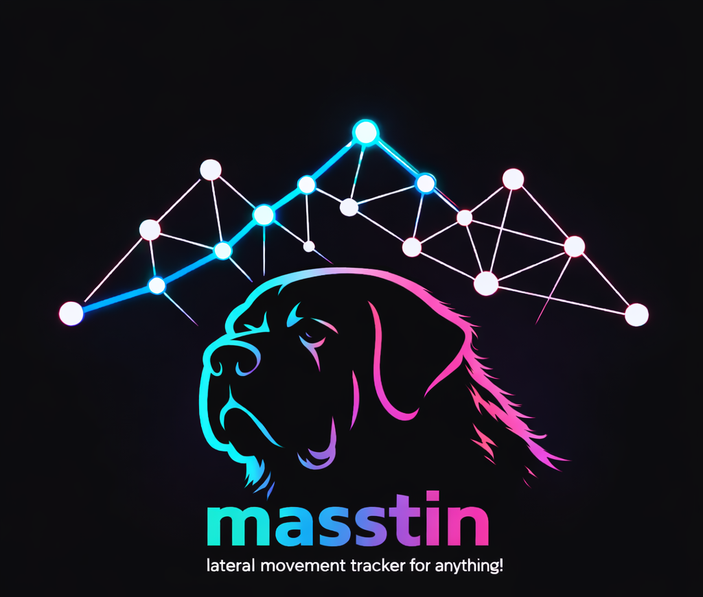
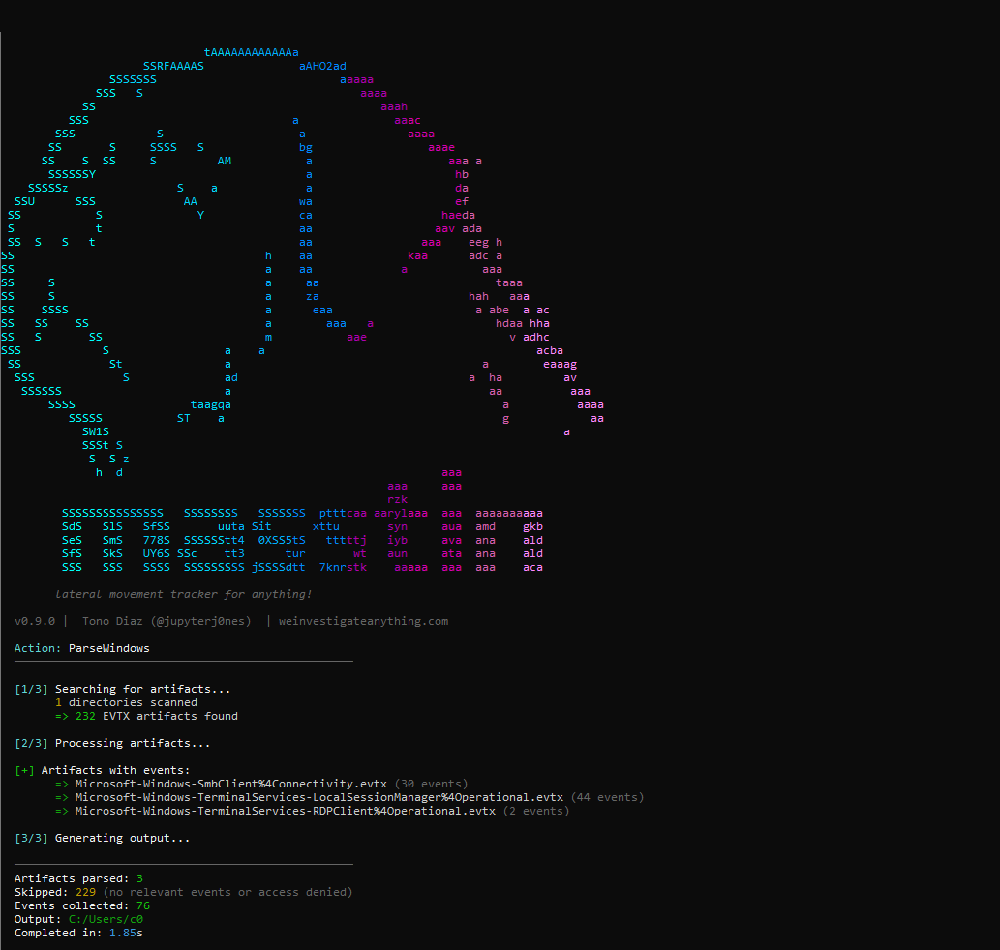
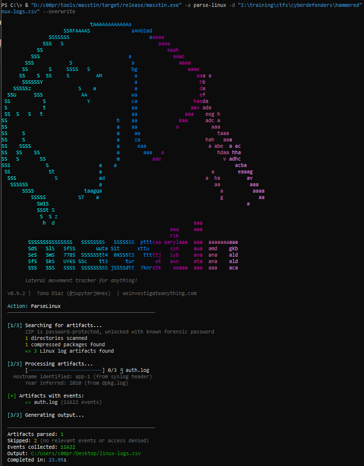
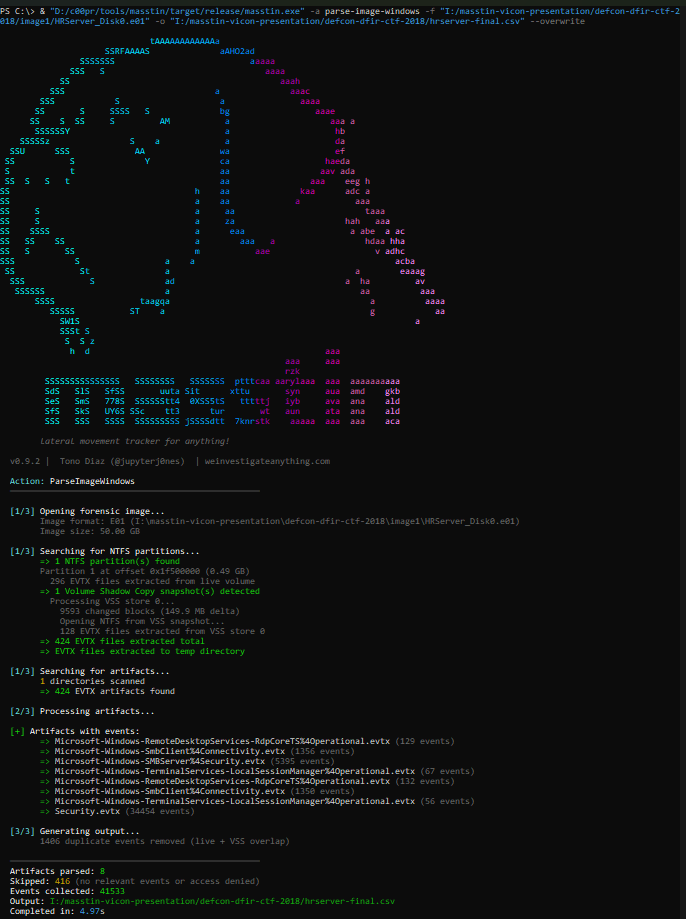
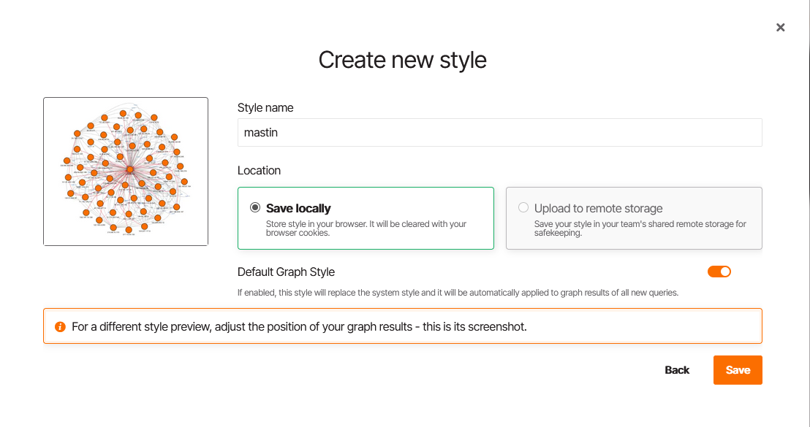
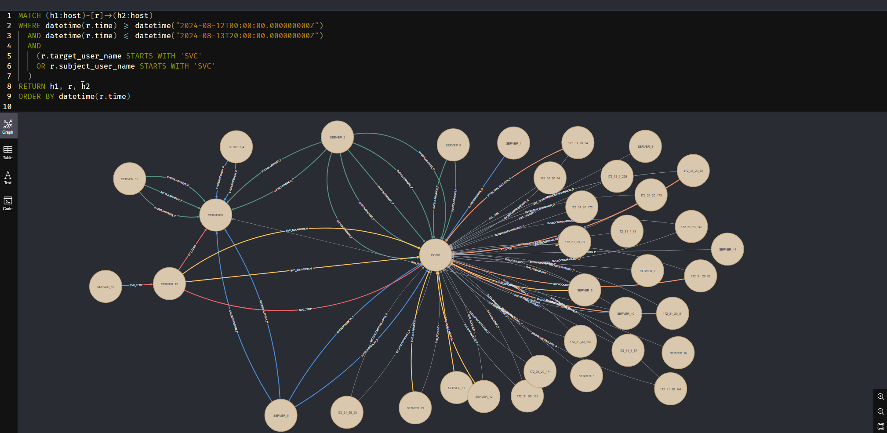
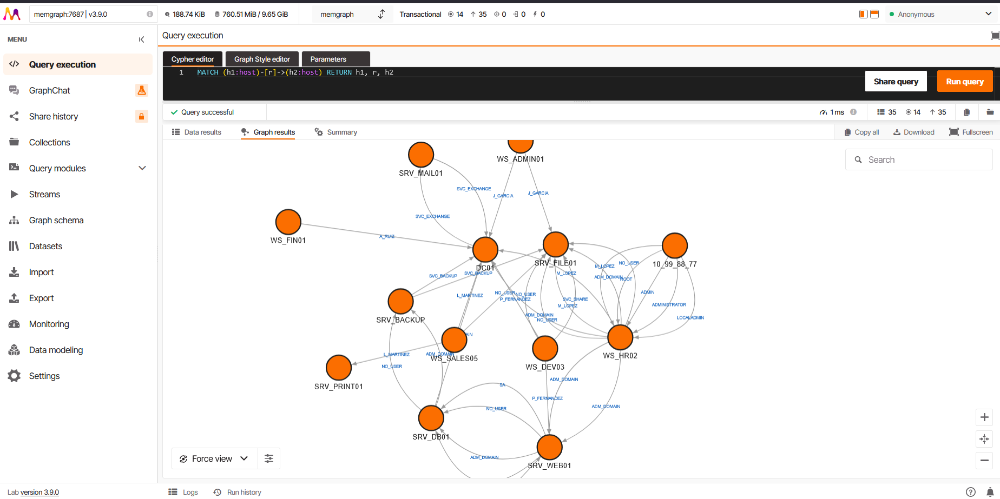
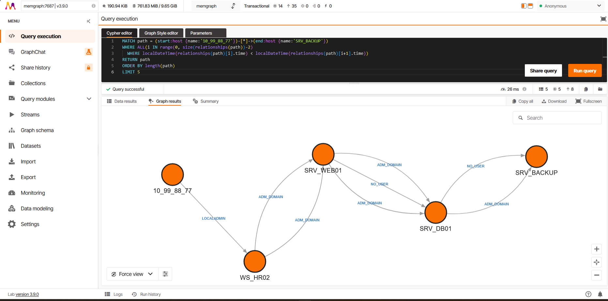

# Masstin - Lateral movement tracker for anything!

<div align="center">
  
  <br><br>
  <strong>Lateral movement tracker for anything!</strong>
  <br><br>

  [](https://www.gnu.org/licenses/agpl-3.0)
  [](https://www.rust-lang.org/)
  []()

</div>

---

**Masstin** is a high-speed DFIR tool written in Rust that parses forensic artifacts and unifies lateral movement data into a single chronological timeline. It supports Windows EVTX, Linux logs, Winlogbeat JSON, and EDR APIs — all merged into one CSV, ready for analysis or graph database visualization (Neo4j, Memgraph).

Named after the [Mastín Leonés](https://en.wikipedia.org/wiki/Spanish_Mastiff) — the guardian dog from the mountains of León, Spain. Like its namesake, Masstin watches over your network and tracks every movement.

> Evolved from [Sabonis](https://github.com/jupyterj0nes/sabonis) (Python), rewritten in Rust for ~90% faster performance.

> **[We Investigate Anything](https://weinvestigateanything.com)** — Masstin is part of the WIA project, a DFIR knowledge base where you'll find detailed documentation for every artifact masstin parses, investigation guides, and real-world case studies — all in English and Spanish.

## Table of Contents

- [Key Features](#key-features)
- [Supported Artifacts](#supported-artifacts)
- [Quick Start](#quick-start)
- [Usage](#usage)
- [Output Format](#output-format)
- [Neo4j Visualization](#neo4j-visualization)
- [All Options](#all-options)
- [Roadmap](#roadmap)
- [Documentation](#documentation)
- [Contributing](#contributing)
- [License](#license)
- [Contact](#contact)

## Key Features

| Feature | Description | Details |
|---------|-------------|---------|
| **Multi-artifact parsing** | 30+ Windows Event IDs from 9 sources + Linux logs + Winlogbeat JSON + Cortex XDR | [Artifacts](https://weinvestigateanything.com/en/artifacts/security-evtx-lateral-movement/) |
| **Forensic image analysis** | Open E01/dd images directly, find NTFS partitions (GPT/MBR), extract EVTX — no mounting needed | [VSS recovery](https://weinvestigateanything.com/en/tools/masstin-vss-recovery/) |
| **VSS snapshot recovery** | Detect and extract EVTX from Volume Shadow Copies — recover event logs deleted by attackers. Uses [vshadow-rs](https://github.com/jupyterj0nes/vshadow-rs) | [VSS recovery](https://weinvestigateanything.com/en/tools/masstin-vss-recovery/) |
| **Event classification** | Every event classified as `SUCCESSFUL_LOGON`, `FAILED_LOGON`, `LOGOFF` or `CONNECT` with human-readable failure reasons | [CSV format](https://weinvestigateanything.com/en/tools/masstin-csv-format/) |
| **Unified timeline** | All sources merged into a single chronological CSV with 14 standardized columns | [CSV format](https://weinvestigateanything.com/en/tools/masstin-csv-format/) |
| **Cross-platform timeline** | Windows EVTX + Linux SSH + EDR data merged with `merge` — one timeline across OS boundaries | |
| **Compressed triage support** | Recursive ZIP extraction with auto-detection of forensic passwords | |
| **Graph visualization** | Direct upload to [Neo4j](https://weinvestigateanything.com/en/tools/neo4j-cypher-visualization/) or [Memgraph](https://weinvestigateanything.com/en/tools/memgraph-visualization/) with connection grouping and IP-to-hostname resolution | |
| **Temporal path reconstruction** | Cypher query to find the chronologically coherent attacker route between two nodes | [Neo4j](https://weinvestigateanything.com/en/tools/neo4j-cypher-visualization/) |
| **Session correlation** | `logon_id` field for matching logon/logoff to determine session duration | [CSV format](https://weinvestigateanything.com/en/tools/masstin-csv-format/) |
| **Linux smart inference** | Auto-detects hostname, infers year from `dpkg.log`, supports Debian and RHEL, RFC3164 and RFC5424 | [Linux artifacts](https://weinvestigateanything.com/en/artifacts/linux-forensic-artifacts/) |
| **Silent mode** | `--silent` flag for Velociraptor, SOAR and automation integration | |
| **Cross-platform** | Windows, Linux & macOS — zero dependencies, single binary | |

## Supported Artifacts

Masstin parses **28 Windows Event IDs** across **9 EVTX sources**, plus Linux artifacts, Winlogbeat JSON, and Cortex XDR. For a full breakdown, see [ARTIFACTS.md](ARTIFACTS.md).

### Windows EVTX

| Source | Event IDs | What it tracks | Article |
|--------|-----------|---------------|---------|
| **Security.evtx** | 4624, 4625, 4634, 4647, 4648, 4768, 4769, 4770, 4771, 4776, 4778, 4779, 5140, 5145 | Logons, logoffs, Kerberos, NTLM, RDP reconnect, share access | [Read more →](https://weinvestigateanything.com/en/artifacts/security-evtx-lateral-movement/) |
| **TerminalServices-LocalSessionManager** | 21, 22, 24, 25 | RDP session lifecycle | [Read more →](https://weinvestigateanything.com/en/artifacts/terminal-services-evtx/) |
| **TerminalServices-RDPClient** | 1024, 1102 | Outgoing RDP connections | [Read more →](https://weinvestigateanything.com/en/artifacts/terminal-services-evtx/) |
| **TerminalServices-RemoteConnectionManager** | 1149 | Incoming RDP accepted | [Read more →](https://weinvestigateanything.com/en/artifacts/terminal-services-evtx/) |
| **RdpCoreTS** | 131 | RDP transport negotiation | [Read more →](https://weinvestigateanything.com/en/artifacts/terminal-services-evtx/) |
| **SMBServer/Security** | 1009, 551 | SMB server connections and auth | [Read more →](https://weinvestigateanything.com/en/artifacts/smb-evtx-events/) |
| **SMBClient/Security** | 31001 | SMB client share access | [Read more →](https://weinvestigateanything.com/en/artifacts/smb-evtx-events/) |
| **SMBClient/Connectivity** | 30803-30808 | SMB connectivity and share events | [Read more →](https://weinvestigateanything.com/en/artifacts/smb-evtx-events/) |

### Linux

| Source | What it tracks | Article |
|--------|---------------|---------|
| `/var/log/auth.log` (Debian/Ubuntu) | SSH success, failure, PAM authentication | [Read more →](https://weinvestigateanything.com/en/artifacts/linux-forensic-artifacts/) |
| `/var/log/secure` (RHEL/CentOS) | SSH success, failure, PAM authentication | [Read more →](https://weinvestigateanything.com/en/artifacts/linux-forensic-artifacts/) |
| `/var/log/messages` | SSH events via syslog | [Read more →](https://weinvestigateanything.com/en/artifacts/linux-forensic-artifacts/) |
| `/var/log/audit/audit.log` | Authentication via audit subsystem | [Read more →](https://weinvestigateanything.com/en/artifacts/linux-forensic-artifacts/) |
| `utmp` / `wtmp` | Active and historical login sessions | [Read more →](https://weinvestigateanything.com/en/artifacts/linux-forensic-artifacts/) |
| `btmp` | Failed login attempts | [Read more →](https://weinvestigateanything.com/en/artifacts/linux-forensic-artifacts/) |
| `lastlog` | Last login per user | [Read more →](https://weinvestigateanything.com/en/artifacts/linux-forensic-artifacts/) |

> **Note:** Both RFC3164 (legacy syslog: `Mar 16 08:25:22 hostname ...`) and RFC5424 (structured syslog) timestamp formats are supported. Masstin can also process compressed triage packages (ZIP) recursively, including password-protected archives using common forensic passwords.

### Winlogbeat

| Source | What it tracks | Article |
|--------|---------------|---------|
| Winlogbeat JSON | All 28 Windows Event IDs in JSON format | [Read more →](https://weinvestigateanything.com/en/artifacts/winlogbeat-elastic-artifacts/) |

### Cortex XDR

| Source | What it tracks | Article |
|--------|---------------|---------|
| Cortex XDR Network | RDP (3389), SMB (445), SSH (22) via API | [Read more →](https://weinvestigateanything.com/en/artifacts/cortex-xdr-artifacts/) |
| Cortex XDR EVTX Forensics | Forensic event logs collected by forensic agents | [Read more →](https://weinvestigateanything.com/en/artifacts/cortex-xdr-artifacts/) |

## Quick Start

Download the latest binary from the [Releases page](https://github.com/jupyterj0nes/masstin/releases) — no installation needed.

Or build from source:

```bash
git clone https://github.com/jupyterj0nes/masstin.git
cd masstin
cargo build --release
# Binary at ./target/release/masstin
```

## Usage

### Parse Windows: Generate a lateral movement timeline

Parses Windows EVTX files from directories or individual files, extracting lateral movement events and merging them into a single chronological CSV. Supports compressed triage packages directly — masstin recursively decompresses and identifies all EVTX files, handling archived logs with duplicate filenames.

> **Note:** The legacy command `parse` is still supported as an alias for backwards compatibility.

```bash
# Single directory (or compressed triage package)
masstin -a parse-windows -d /evidence/logs/ -o timeline.csv

# Multiple machines
masstin -a parse-windows -d /machine1/logs -d /machine2/logs -o timeline.csv --overwrite

# Individual EVTX files
masstin -a parse-windows -f Security.evtx -f System.evtx -o timeline.csv

# Time filtering
masstin -a parse-windows -d /evidence/ -o timeline.csv \
  --start-time "2024-08-12 00:00:00" \
  --end-time "2024-08-14 00:00:00"
```

<div align="center">
  
</div>

The output shows three phases: **[1/3]** scans directories and compressed packages to discover EVTX artifacts, **[2/3]** processes each artifact and shows progress, then lists every source that produced events with its count, and **[3/3]** generates the sorted CSV timeline. The final summary shows how many artifacts were parsed, how many were skipped (no relevant events or access denied), total events collected, and execution time. Use `--silent` to suppress all output for automation.

### Parse Linux logs

Parses Linux system logs and accounting entries to extract SSH sessions and authentication events. Supports both Debian/Ubuntu (`auth.log`) and RHEL/CentOS (`secure`) log formats, with both RFC3164 (legacy syslog) and RFC5424 (structured) timestamp formats. Like `parse-windows`, it recursively decompresses ZIP archives, including password-protected packages commonly used in CTFs and forensic triage distributions.

```bash
# Directory with extracted logs
masstin -a parse-linux -d /evidence/var/log/ -o linux-timeline.csv

# Compressed forensic package (auto-extracts, supports passwords)
masstin -a parse-linux -d /evidence/triage_package/ -o linux-timeline.csv
```

<div align="center">
  
</div>

Masstin transparently reports all inferences: hostname identification (from `/etc/hostname`, `dmesg`, or the syslog header), year inference (from `dpkg.log`, `wtmp`, or file modification date), and password-protected ZIP extraction.

### Parse forensic images (E01/dd) with VSS recovery

Opens forensic disk images directly — no mounting needed. Finds NTFS partitions (GPT/MBR), extracts EVTX from the live volume, detects Volume Shadow Copies, and recovers EVTX from each VSS snapshot. Events are deduplicated across live and VSS sources.

```bash
# Single image with VSS recovery
masstin -a parse-image-windows -f HRServer.e01 -o timeline.csv

# Multiple images for large-scale incident
masstin -a parse-image-windows -f DC01.e01 -f SRV-FILE.e01 -f Desktop.e01 -o incident.csv
```

<div align="center">
  
</div>

Uses the [vshadow-rs](https://github.com/jupyterj0nes/vshadow-rs) crate for cross-platform VSS access. [Full documentation →](https://weinvestigateanything.com/en/tools/masstin-vss-recovery/)

### Parse Winlogbeat JSON

Parses Winlogbeat JSON logs forwarded to Elasticsearch. Extracts the same lateral movement data from JSON format when EVTX files are unavailable.

```bash
masstin -a parser-elastic -d /evidence/winlogbeat/ -o elastic-timeline.csv
```

### Parse Cortex XDR

Queries the Cortex XDR API directly to retrieve network connection data or EVTX forensic artifacts collected by Cortex agents.

```bash
# Network connection data
masstin -a parse-cortex --cortex-url api-xxxx.xdr.xx.paloaltonetworks.com \
  --start-time "2024-08-12 00:00:00" --end-time "2024-08-14 00:00:00" \
  -o cortex-network.csv

# EVTX forensics collected by Cortex agents
masstin -a parse-cortex-evtx-forensics --cortex-url api-xxxx.xdr.xx.paloaltonetworks.com \
  --start-time "2024-08-12 00:00:00" --end-time "2024-08-14 00:00:00" \
  -o cortex-evtx.csv
```

### Merge: Combine multiple timelines

Merges multiple CSV files into a single time-sorted timeline. Useful when artifacts were parsed from different sources or at different times.

```bash
masstin -a merge -f timeline1.csv -f timeline2.csv -o merged.csv
```

### Load into graph database

Uploads a previously generated CSV into a graph database for visual investigation. Automatically resolves IPs to hostnames using frequency analysis, and groups repetitive connections to reduce noise. See the [Graph Visualization](#graph-visualization-neo4j--memgraph) section below for installation instructions.

```bash
# Neo4j
masstin -a load-neo4j -f timeline.csv --database localhost:7687 --user neo4j

# Memgraph
masstin -a load-memgraph -f timeline.csv --database localhost:7687
```

> **Note:** The legacy command `load` is still supported as an alias for `load-neo4j`.

## Output Format

All actions produce a unified CSV with 14 columns:

| Column | Description |
|--------|-------------|
| `time_created` | Event timestamp |
| `dst_computer` | Destination hostname |
| `event_type` | Event classification (see below) |
| `event_id` | Original Event ID from the source (e.g., `4624`, `SSH_SUCCESS`) |
| `logon_type` | Windows logon type as reported by the event (e.g., `2`, `3`, `10`) |
| `target_user_name` | Target user account |
| `target_domain_name` | Target domain |
| `src_computer` | Source hostname |
| `src_ip` | Source IP address |
| `subject_user_name` | Subject user account |
| `subject_domain_name` | Subject domain |
| `logon_id` | Logon ID for session correlation (e.g., `0x1A2B3C`) |
| `detail` | Additional context: SubStatus for failed logons, process name, SSH auth method |
| `log_filename` | Original log file |

### Event Type Categories

| event_type | Meaning |
|---|---|
| `SUCCESSFUL_LOGON` | Authentication succeeded — user authenticated correctly and session was established |
| `FAILED_LOGON` | Authentication failed — incorrect credentials, locked account, or pre-auth failure |
| `LOGOFF` | Session ended — user logged off or session was disconnected |
| `CONNECT` | Connection event — network-level connection with no authentication result |

For the complete Event ID to event_type mapping across all 28+ Event IDs, see the [full documentation](https://weinvestigateanything.com/en/tools/masstin-lateral-movement-rust/).

## Graph Visualization (Neo4j / Memgraph)

Masstin supports two graph databases. Both use the Cypher query language and the same queries work on both with minor differences.

### Neo4j

| Step | Windows | Linux | macOS | Docker (all platforms) |
|------|---------|-------|-------|------------------------|
| **Install** | Download [Neo4j Desktop](https://neo4j.com/download/) and install | `sudo apt install neo4j` or [download](https://neo4j.com/download/) | `brew install neo4j` or [download](https://neo4j.com/download/) | `docker run -p 7474:7474 -p 7687:7687 -e NEO4J_AUTH=neo4j/password neo4j` |
| **Start** | Open Neo4j Desktop, create a database, click Start | `sudo systemctl start neo4j` | `neo4j start` | Runs automatically |
| **Browser** | `http://localhost:7474` | `http://localhost:7474` | `http://localhost:7474` | `http://localhost:7474` |
| **Load data** | `masstin.exe -a load-neo4j -f timeline.csv --database localhost:7687 --user neo4j` | `masstin -a load-neo4j -f timeline.csv --database localhost:7687 --user neo4j` | Same as Linux | Same as Linux |

### Memgraph

| Step | Windows | Linux | macOS | Docker (all platforms) |
|------|---------|-------|-------|------------------------|
| **Install** | Via Docker — requires WSL 2 + Docker Desktop (see below) | `sudo apt install memgraph` or [download](https://memgraph.com/download/) | Use Docker (recommended) | `docker compose` with `memgraph/memgraph-mage` + `memgraph/lab` |
| **Start** | `iwr https://windows.memgraph.com \| iex` (starts DB + Lab via docker compose) | `sudo systemctl start memgraph` | — | Runs automatically |
| **Browser** | `http://localhost:3000` (Memgraph Lab) | `http://localhost:3000` | `http://localhost:3000` | `http://localhost:3000` |
| **Load data** | `masstin.exe -a load-memgraph -f timeline.csv --database localhost:7687` | `masstin -a load-memgraph -f timeline.csv --database localhost:7687` | Same as Linux | Same as Linux |

> **Note:** Memgraph runs in-memory. Data is lost on restart unless [snapshots are configured](https://memgraph.com/docs/fundamentals/data-durability).

> **Graph style:** A ready-to-use GSS style for Memgraph Lab is available at [`memgraph-resources/style.gss`](memgraph-resources/style.gss). Copy its contents into the Graph Style editor in Memgraph Lab, click Apply, then click **Save style** with name `masstin` and enable **Default Graph Style** to apply it automatically to all future queries.
>
> <div align="center"></div>

#### Windows prerequisites for Memgraph (WSL 2 + Docker)

On Windows, Memgraph runs inside a Docker container, and Docker Desktop requires WSL 2. The dependency chain is: **WSL 2 → Docker Desktop → Memgraph container**.

**1. Enable WSL 2** — Open PowerShell as Administrator:

```powershell
dism.exe /online /enable-feature /featurename:Microsoft-Windows-Subsystem-Linux /all /norestart
dism.exe /online /enable-feature /featurename:VirtualMachinePlatform /all /norestart
```

Restart your PC, then:

```powershell
wsl --update
wsl --set-default-version 2
wsl --install
```

**2. Install Docker Desktop** — Download from [docker.com](https://www.docker.com/products/docker-desktop/). Select "Use WSL 2 instead of Hyper-V" during installation. Restart if prompted.

**3. Install and run Memgraph:**

```powershell
iwr https://windows.memgraph.com | iex
```

This downloads a `docker-compose.yml` and starts the database (`memgraph/memgraph-mage`) and the web interface (`memgraph/lab`). Open `http://localhost:3000` — Memgraph Lab is ready.

<details>
<summary><strong>Troubleshooting WSL / Docker on Windows</strong></summary>

**Docker Desktop distro installation timeout** (`DockerDesktop/Wsl/CommandTimedOut`):

Run `wsl --status`. If you see `ERROR_SERVICE_DOES_NOT_EXIST`, the WSL service is not registered. Fix:

```powershell
sc.exe create WslService binPath= 'C:\Program Files\WSL\wslservice.exe' start= auto
sc.exe start WslService
wsl --install
```

**wsl --update fails: "The older version cannot be removed"** (error 1603):

A previous WSL installation left a corrupted MSI entry. Fix:

```powershell
winget uninstall "Windows Subsystem for Linux"
wsl --install
```

If `winget` is not available, find the product GUID in `%TEMP%\wsl-install-logs.txt` (look for the `MIGRATE` property) and run `msiexec /x "{GUID}" /qn`, then `wsl --install`.

For the full troubleshooting guide, see [Memgraph: In-Memory Visualization](https://weinvestigateanything.com/en/tools/memgraph-visualization/).

</details>

### Querying the graph

After loading data, use Cypher queries to explore lateral movement.

**Neo4j** — filter by time range with `datetime()`:

```cypher
MATCH (h1:host)-[r]->(h2:host)
WHERE datetime(r.time) >= datetime("2024-08-12T00:00:00Z")
  AND datetime(r.time) <= datetime("2024-08-13T00:00:00Z")
RETURN h1, r, h2
ORDER BY datetime(r.time)
```

<div align="center">
  
</div>

**Memgraph** — view all lateral movement:

```cypher
MATCH (h1:host)-[r]->(h2:host)
RETURN h1, r, h2
```

<div align="center">
  
</div>

**Memgraph** — temporal path reconstruction (from `10_99_88_77` to `SRV_BACKUP`):

```cypher
MATCH path = (start:host {name:'10_99_88_77'})-[*]->(end:host {name:'SRV_BACKUP'})
WHERE ALL(i IN range(0, size(relationships(path))-2)
  WHERE localDateTime(relationships(path)[i].time) < localDateTime(relationships(path)[i+1].time))
RETURN path
ORDER BY length(path)
LIMIT 5
```

<div align="center">
  
</div>

For the full query catalog (10 queries including temporal path reconstruction), see the [Cypher Resources](neo4j-resources/cypher_queries.md).

## All Options

| Option | Description |
|--------|-------------|
| `-a, --action` | `parse-windows` \| `parse-linux` \| `parse-image-windows` \| `parser-elastic` \| `parse-cortex` \| `parse-cortex-evtx-forensics` \| `merge` \| `load-neo4j` \| `load-memgraph` |
| `-d, --directory` | Directories to process (repeatable) |
| `-f, --file` | Individual files to process (repeatable) |
| `-o, --output` | Output file path |
| `--database` | Neo4j URL (e.g., `localhost:7687`) |
| `-u, --user` | Neo4j user |
| `--cortex-url` | Cortex API base URL |
| `--start-time` | Filter start: `"YYYY-MM-DD HH:MM:SS"` |
| `--end-time` | Filter end: `"YYYY-MM-DD HH:MM:SS"` |
| `--filter-cortex-ip` | Filter by IP in Cortex queries |
| `--overwrite` | Overwrite output file if it exists |
| `--stdout` | Print output to stdout only |
| `--debug` | Print debug information |

## Roadmap

- [ ] **Event reconstruction** — Reconstruct lateral movement events even when EVTX logs have been cleared or tampered with on the system

## Documentation - We Investigate Anything

Masstin's full documentation lives at **[We Investigate Anything](https://weinvestigateanything.com)** (WIA), a bilingual DFIR knowledge base (English/Spanish). There you'll find:

- [Masstin main page](https://weinvestigateanything.com/en/tools/masstin-lateral-movement-rust/) — complete tool guide
- [Security.evtx events](https://weinvestigateanything.com/en/artifacts/security-evtx-lateral-movement/) — 12 Event IDs explained
- [Terminal Services events](https://weinvestigateanything.com/en/artifacts/terminal-services-evtx/) — RDP session lifecycle
- [SMB events](https://weinvestigateanything.com/en/artifacts/smb-evtx-events/) — Server and client artifacts
- [Linux forensic artifacts](https://weinvestigateanything.com/en/artifacts/linux-forensic-artifacts/) — SSH, utmp, wtmp, btmp
- [Winlogbeat artifacts](https://weinvestigateanything.com/en/artifacts/winlogbeat-elastic-artifacts/) — JSON log parsing
- [Cortex XDR artifacts](https://weinvestigateanything.com/en/artifacts/cortex-xdr-artifacts/) — Network and forensic agent modes
- [Neo4j and Cypher guide](https://weinvestigateanything.com/en/tools/neo4j-cypher-visualization/) — Cypher queries and time filtering
- [Memgraph guide](https://weinvestigateanything.com/en/tools/memgraph-visualization/) — In-memory graph visualization

## Contributing

Contributions are welcome! Fork the repository and submit pull requests.

## License

GNU Affero General Public License v3.0 — see [LICENSE](LICENSE) for details.

## Contact

**Toño Díaz** ([@jupyterj0nes](https://github.com/jupyterj0nes)) · [LinkedIn](https://www.linkedin.com/in/antoniodiazcastano/) · [weinvestigateanything.com](https://weinvestigateanything.com)
