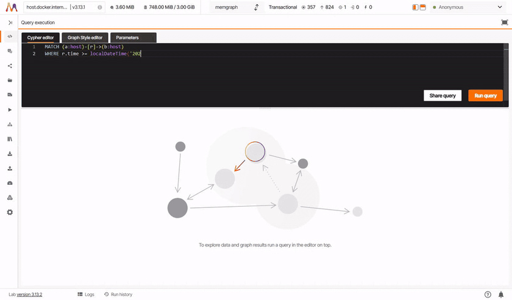

# Masstin

<div align="center">
  
  <br><br>
  <strong>Lateral movement tracker for anything.</strong>
  <br>
  One timeline from every log you have. One statistical hunt over it. No SIEM, no plugins, one binary.
  <br><br>

  [](https://github.com/jupyterj0nes/masstin/releases/latest)
  [](https://crates.io/crates/masstin)
  [](https://www.gnu.org/licenses/agpl-3.0)
  [](https://github.com/jupyterj0nes/masstin/releases/latest)

</div>

<div align="center">
  
  <br>
  <em>parse-windows over 293 EVTX samples from twelve providers: discovery, per-folder breakdown, duplicates removed, and the 14-column timeline at the end.</em>
</div>

## What it does

An incident leaves logins in a dozen places: Security.evtx on fifty Windows hosts, `wtmp` and `auth.log` on the Linux side, UAL databases nobody remembers, EDR exports, a VPN concentrator. Masstin reads all of them and answers one question: **who logged in where, with what, and when.**

- **Parse anything into one timeline.** Forensic images (E01, VMDK, dd) with VSS recovery and EVTX carving, KAPE / Velociraptor / UAC / Cortex triages, loose EVTX, Linux logs including binary journald, Winlogbeat JSON, Cortex XDR, and any text or JSON log through a YAML rule. Every source lands in the same 14-column CSV. [Parsing →](docs/parsing.md)
- **Hunt with statistics, not thresholds.** `graph-hunt` splits the timeline at a cutoff, measures every window connection against the network's own baseline and reports what survives a false-discovery-rate test. The only number you choose is the FDR. It explains each finding in words, classes it the way the Hopper paper does, reconstructs chains from a seed and writes an analyst report. [graph-hunt →](docs/graph-hunt.md)
- **See it as a graph.** Load the timeline into Neo4j or Memgraph in seconds, with IP ↔ hostname unification, session pairing and a Cypher catalogue for temporal path reconstruction. [Graph databases →](docs/graph-databases.md)

<div align="center">
  
  <br>
  <em>The same timeline in Memgraph Lab: every login of the hour the attacker came in, then one Cypher query from the catalogue returns the chronologically valid path from the attacker's IP to the workstation it reached. DFIR Madness "Szechuan sauce" case.</em>
</div>

## Quick start

Download the binary for your platform from the [Releases page](https://github.com/jupyterj0nes/masstin/releases/latest), or `cargo install masstin`. No runtime dependencies.

```bash
# 1. Everything under the evidence folder (images, zips, triages, loose files) -> one timeline
masstin -a parse-massive -d /evidence/case-2026-03 -o timeline.csv

# 2. Hunt: what happened after the cutoff that this network had never done before?
masstin -a graph-hunt-csv -f timeline.csv --investigation-from "2026-03-15 00:00:00" \
        --report hunt.md -o hunt.csv

# 3. Known-bad host or account? Reconstruct the chain from it
masstin -a graph-hunt-csv -f timeline.csv --investigation-from "2026-03-15 00:00:00" \
        --seed 10.10.1.50 --report hunt.md -o hunt.csv

# 4. Optional: load the graph and look at it
masstin -a load-memgraph -f timeline.csv --database bolt://localhost:7687 --ungrouped
```

> **macOS first run:** if Gatekeeper blocks the binary, run `xattr -d com.apple.quarantine masstin-*` once.

## What it reads

| Source | What masstin extracts |
|---|---|
| **Windows EVTX** | 33+ Event IDs across 12 providers: Security (4624/4625/4634/4647/4648/4768/4769/4771/4776/4778/4779/5140…), Terminal Services, RDP client and core, SMB server and client, WinRM, WMI-Activity, Sysmon Event 3, Scheduled Tasks. Archived and renamed EVTX are routed by provider name. |
| **Windows beyond EVTX** | UAL (User Access Logging) ESE databases, MountPoints2 from NTUSER.DAT, Volume Shadow Copies, EVTX chunks carved from unallocated space. |
| **Forensic images** | E01 (multi-segment), VMDK (flat, sparse, streamOptimized), dd/raw, mounted volumes, images packed inside zips. OS detected per partition; NTFS and ext4 both walked. BitLocker detected and reported. |
| **Linux** | `auth.log`, `secure`, `messages`, `wtmp`/`btmp`/`lastlog`, `audit.log`, binary journald. Session ends paired to their login, syslog times converted to UTC, OpenSSH 9.8 `sshd-session` understood. |
| **Triage packages** | KAPE, Velociraptor offline collector, UAC, Cortex XDR, plain zips and tarballs, nested in each other. |
| **Feeds** | Winlogbeat JSON, Cortex XDR network connections and forensic EVTX, Mordor / OTRF Security-Datasets. |
| **Anything else** | `parse-custom` with a YAML rule: csv, regex, key=value and JSON extractors. Ships with rules for Palo Alto, Cisco, Fortinet, OpenVPN, Squid and Mordor. [Custom parsers →](docs/custom-parsers.md) |

The full artifact list with the fields taken from each event is in [ARTIFACTS.md](ARTIFACTS.md). The 14 columns are described in [docs/csv-format.md](docs/csv-format.md).

## How graph-hunt decides

A connection is one origin logging in to one destination with one account on one day. Connections that already happened on another baseline day are habitual and never reported. For the new ones, ten facts are measured against the baseline (first-time destination, account the origin never used, account that belongs to another machine, failed sweeps, pre-auth touches, logon type, graph centrality, community crossing, chain speed, Sigma hits from Hayabusa / Chainsaw when given) and combined into one empirical p-value per origin-day. Benjamini-Hochberg across all of them controls the false discovery rate you asked for.

<div align="center">
  
  <br>
  <em>graph-hunt-csv on the public Los Alamos set, no seed, no hint: 21 million logins read, every new connection measured against the baseline, 204 survive the 5 % false discovery rate, and the first rows are the red-team machine switching credentials on hosts it had never reached. The 22 minutes of computation are cut out of the recording.</em>
</div>

Two cases where the truth is known beforehand, and what the hunt reports on each with no seed and no hint:

| Case | What is known | What graph-hunt reports |
|---|---|---|
| **DFIR Madness "Szechuan sauce"**: 2 disk images, 5,916 rows, 2 days of logs | One external IP enters the DC over RDP and goes on to the workstation | 0 significant: with one baseline day there is no null to test against, and it says so instead of inventing a threshold. With that IP as `--seed`, the 4-hop chain with its certainties (the recording at the top of this section's docs). |
| **LANL authentication set** (public): 21.3 M rows, 749 labelled red-team logins | Four red-team machines; 444 red-team connections in the window | 204 significant: 185 red team plus one unlabelled machine that failed on 47 hosts and then logged in with 7 new accounts; the first 83 rows are all red team, 99 % of the first 100; 0 significant on an incident-free period |

The design, the assumptions and the limits are in [docs/graph-hunt-statistics.md](docs/graph-hunt-statistics.md). The hunt runs straight from the CSV (`graph-hunt-csv`), on Memgraph (`graph-hunt`) or on Neo4j (`graph-hunt-neo4j`), with no server-side plugin.

## Documentation

| Topic | Where |
|---|---|
| Every `parse-*` action, noise filtering, triage detection, carving, merge | [docs/parsing.md](docs/parsing.md) |
| graph-hunt: options, output columns, report, seeds, Sigma corroboration, detection quality | [docs/graph-hunt.md](docs/graph-hunt.md) |
| Statistics behind the hunt | [docs/graph-hunt-statistics.md](docs/graph-hunt-statistics.md) |
| Loading into Neo4j / Memgraph, visualisation, query catalogue | [docs/graph-databases.md](docs/graph-databases.md) · [Cypher queries](neo4j-resources/cypher_queries.md) |
| Custom parsers (YAML rules) | [docs/custom-parsers.md](docs/custom-parsers.md) |
| Every command-line option | [docs/cli-options.md](docs/cli-options.md) |
| Artifacts and fields | [ARTIFACTS.md](ARTIFACTS.md) |
| Articles, in English and Spanish | [weinvestigateanything.com](https://weinvestigateanything.com/en/tools/masstin-lateral-movement-rust/) |

`masstin --help` lists every action and flag.

## Roadmap

- VHD/VHDX images; macOS (`parse-mac`, APFS images)
- EVTX carving Tier 3 (template matching) and unallocated-only scan
- EVTX header tampering detection; Linux log carving
- More custom-parser rules (Checkpoint, ZScaler, Cloudflare Access, Juniper, SonicWall); conditional map and per-rule `--validate`
- Official Velociraptor plugin

## About

Masstin is the Rust rewrite of [Sabonis](https://github.com/jupyterj0nes/sabonis), named after the [Mastín Leonés](https://en.wikipedia.org/wiki/Spanish_Mastiff), the guardian dog of the mountains of León. It builds on stable Rust with a plain `cargo build --release`. If you use it in research, [CITATION.cff](CITATION.cff) has the reference.

Licensed under the GNU Affero General Public License v3.0 ([LICENSE](LICENSE)).

**Toño Díaz** ([@jupyterj0nes](https://github.com/jupyterj0nes)) · [LinkedIn](https://www.linkedin.com/in/antoniodiazcastano/) · [weinvestigateanything.com](https://weinvestigateanything.com)
