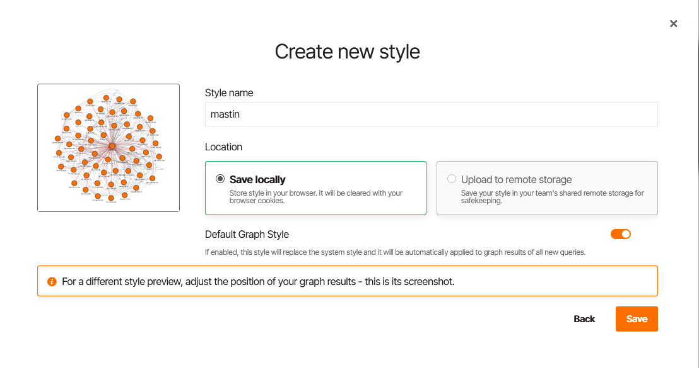
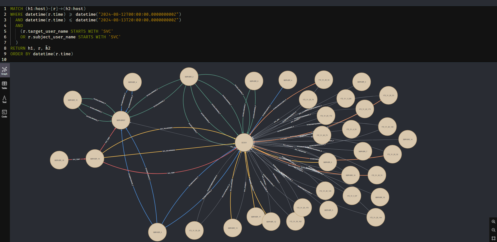
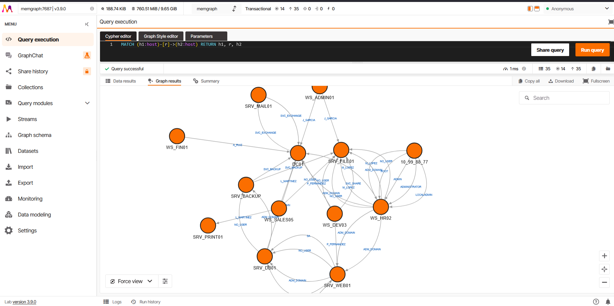
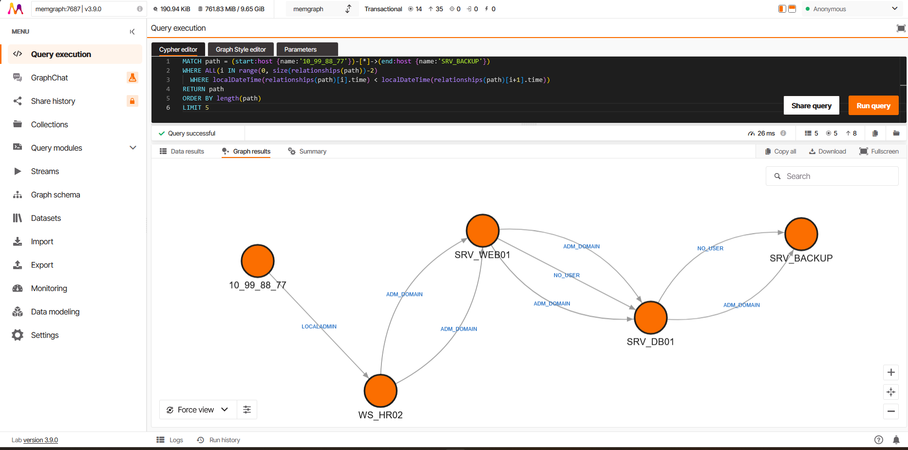

# Graph databases: Neo4j and Memgraph

Loading a timeline, grouped vs ungrouped, IP ↔ hostname unification, loader internals, visualisation and the query catalogue. Back to the [README](../README.md).

## Load into graph database

```bash
# Neo4j
masstin -a load-neo4j -f timeline.csv --database localhost:7687 --user neo4j

# Memgraph
masstin -a load-memgraph -f timeline.csv --database localhost:7687
```

### Grouped vs ungrouped: two modes for two questions

The loader supports two modes depending on what you are investigating:

**Grouped (default)** — one edge per unique `(destination, user, logon_type)` combination. The edge carries a `count` property (how many events collapsed into it) and a `time` property (earliest event). This produces a clean, readable graph that answers **"who talks to whom and how"** — the global picture. Ideal for understanding network topology, mapping trust boundaries, and presenting findings.

**Ungrouped (`--ungrouped`)** — one edge per CSV row with its real timestamp. This preserves full temporal granularity so you can query for **chronologically coherent paths**: "the attacker logged in from A to B at 10:00, then from B to C at 10:05". This is the mode for active hunting. Always pair it with `--start-time` / `--end-time` to scope the window — loading an ungrouped 250k-row timeline without a time filter will create an unusable graph.

| Mode | Edges | Best for |
|------|-------|----------|
| Grouped (default) | ~100-200 | Global overview, topology, presentations |
| `--ungrouped` | 1 per CSV row | Temporal path hunting, incident timeline |

### Load options

| Flag | Effect |
|------|--------|
| `--ungrouped` | One edge per CSV row (`CREATE`) instead of grouping. Preserves real timestamps for temporal path queries. Pair with `--start-time` / `--end-time`. |
| `--start-time "YYYY-MM-DD HH:MM:SS"` | Drop rows whose `time_created` is earlier than this. |
| `--end-time "YYYY-MM-DD HH:MM:SS"` | Drop rows whose `time_created` is later than this. |

```bash
# Global overview — who talks to whom (default, grouped)
masstin -a load-neo4j -f timeline.csv --database localhost:7687 --user neo4j

# Temporal hunting — every individual event in a 30-minute window
masstin -a load-neo4j -f timeline.csv --database localhost:7687 --user neo4j \
        --ungrouped --start-time "2026-03-15 14:00:00" --end-time "2026-03-15 14:30:00"
```

### IP ↔ hostname unification

The same physical host often appears as both an IP and a hostname depending on which event populated each row. Both loaders fold an IP into a hostname node with the same test graph-hunt uses to decide that an IP and a name are one machine: every second in which the same login (destination, account, outcome) was recorded once by IP and once by name is a vote "IP is NAME"; a binomial test against the rate of chance coincidences, Benjamini-Hochberg across every (IP, name) candidate, accepts a name only when its votes are far beyond chance and no second name is significant for that IP (details in [docs/graph-hunt-statistics.md](graph-hunt-statistics.md#ip--host-name-loaders-and-graph-hunt)). The host node lists the IPs folded into it in `aliases`, with the votes and the chance probability behind each one in `alias_votes` and `alias_p`, so the analyst can see why. A loaded graph and `graph-hunt-csv` therefore see the same machines.

When the test cannot tie an IP to a hostname (an external attacker IP with no matching session, an IP that only ever appears alone, two names in conflict), the IP stays as its own node; `merge-neo4j-nodes` / `merge-memgraph-nodes` unify by hand when the analyst knows better.

> Until October 2026 the loaders used a frequency map of (src_ip, src_computer) pairs, weighted x1000 for 4778/4779 and x100 for machine accounts, and took the most frequent name. A renamed machine (a DC that was `WIN-E0PO207ERMD` before becoming `CITADEL-DC01` in the DFIR Madness case) kept its old name alive as a second node and the graph disagreed with the hunt. That map is gone.

### Loader internals: why it is fast and never loses an edge

The loader is built so that **every CSV row that makes it past the filters lands as exactly one edge in the graph** — no silent drops, no retries hiding failures. Five design choices add up to that guarantee while keeping the load near-linear in edge count:

1. **`CREATE INDEX :host(name)` at connect time** (idempotent). Without it, every per-edge `MERGE (h:host {name: ...})` does a full label scan, turning the load into O(V·E) — super-linear and effectively unusable past a few hundred thousand edges. With it, each MERGE is an indexed lookup.
2. **One-pass resolution in Rust.** IP→hostname unification, self-loop filtering and relationship-type sanitization all happen client-side once, before anything touches Bolt. The database phase is a pure write — no logic to retry.
3. **`UNWIND` batches of 5000 edges per round-trip**, bucketed by relationship type (Cypher cannot parametrize a relationship type, and masstin's schema uses the sanitized username as the rel type). One Bolt round-trip per 5000 edges instead of one per edge.
4. **One-shot host-node pre-create**, then `MATCH` (not `MERGE`) for the endpoints inside each edge batch. With the index already in place, MATCH is the cheapest possible lookup, and the edge batches no longer reason about node existence.
5. **Strictly serial execution.** An opt-in concurrent path was tried and reverted: Memgraph 3.9.x SIGSEGVs under concurrent writes (timing-dependent race), Neo4j tolerated concurrency but the deadlock-retry-backoff overhead actually made it slower than serial on the test corpus, and any retry policy admitted the theoretical risk of silently dropping edges. Serial = no contention = zero retries needed = zero loss by construction.

**Measured impact** (cumulative load of a 1 M-edge test corpus on the same Memgraph 3.9 host):

| | Time | Throughput | Load curve |
|--|-----:|----------:|-----------|
| Before this optimization | 50.9 min | 327 edges/s | super-linear (exp ≈ 1.20) |
| After (current default) | 23.0 min | 726 edges/s | near-linear (exp ≈ 1.09) |

On Neo4j 4.2 the same loader hits ~12 000 edges/s on the same corpus — Neo4j is about an order of magnitude faster per write than Memgraph for this workload, so a 4 GB / ~27 M-edge CSV that takes ~13 h on Memgraph extrapolates to ~37 min on Neo4j.

### Driving load-neo4j without a password prompt

By default `load-neo4j` prompts for the password interactively (`rpassword`), which is fine on the desk but breaks scripts and CI. Set the **`NEO4J_PASSWORD` environment variable** before invoking masstin to skip the prompt:

```bash
# Linux / macOS
NEO4J_PASSWORD='your-pass' masstin -a load-neo4j -f timeline.csv \
    --database bolt://localhost:7687 --user neo4j

# PowerShell
$env:NEO4J_PASSWORD = 'your-pass'
masstin.exe -a load-neo4j -f timeline.csv `
    --database bolt://localhost:7687 --user neo4j
```

When the variable is unset or empty the loader falls back to the interactive prompt. The password lives in the process environment — do not export it from a shared shell or a logged dotfile.


## Merge graph nodes after loading

If you discover post-hoc that two `:host` nodes are the same physical machine (for example because the loader had no 4778/4779 evidence to unify them), use the `merge-*-nodes` actions to fuse them. They transfer every relationship from `--old-node` to `--new-node`, preserving relationship type and properties, and then delete the orphan node. **No APOC or MAGE plugin required** — masstin introspects the relationship types client-side and emits one transfer query per type.

```bash
# Neo4j
masstin -a merge-neo4j-nodes \
        --database bolt://localhost:7687 --user neo4j \
        --old-node "10.0.0.10" --new-node "WORKSTATION-A"

# Memgraph
masstin -a merge-memgraph-nodes \
        --database localhost:7687 \
        --old-node "10.0.0.10" --new-node "WORKSTATION-A"
```


## Graph visualization

Masstin supports two graph databases. Both use the Cypher query language and the same queries work on both with minor differences.

## Neo4j

| Step | Windows | Linux | macOS | Docker (all platforms) |
|------|---------|-------|-------|------------------------|
| **Install** | Download [Neo4j Desktop](https://neo4j.com/download/) and install | `sudo apt install neo4j` or [download](https://neo4j.com/download/) | `brew install neo4j` or [download](https://neo4j.com/download/) | `docker run -p 7474:7474 -p 7687:7687 -e NEO4J_AUTH=neo4j/password neo4j` |
| **Start** | Open Neo4j Desktop, create a database, click Start | `sudo systemctl start neo4j` | `neo4j start` | Runs automatically |
| **Browser** | `http://localhost:7474` | `http://localhost:7474` | `http://localhost:7474` | `http://localhost:7474` |
| **Load data** | `masstin.exe -a load-neo4j -f timeline.csv --database localhost:7687 --user neo4j` | `masstin -a load-neo4j -f timeline.csv --database localhost:7687 --user neo4j` | Same as Linux | Same as Linux |

## Memgraph

| Step | Windows | Linux | macOS | Docker (all platforms) |
|------|---------|-------|-------|------------------------|
| **Install** | Via Docker — requires WSL 2 + Docker Desktop (see below) | `sudo apt install memgraph` or [download](https://memgraph.com/download/) | Use Docker (recommended) | `docker compose` with `memgraph/memgraph-mage` + `memgraph/lab` |
| **Start** | `iwr https://windows.memgraph.com \| iex` (starts DB + Lab via docker compose) | `sudo systemctl start memgraph` | — | Runs automatically |
| **Browser** | `http://localhost:3000` (Memgraph Lab) | `http://localhost:3000` | `http://localhost:3000` | `http://localhost:3000` |
| **Load data** | `masstin.exe -a load-memgraph -f timeline.csv --database localhost:7687` | `masstin -a load-memgraph -f timeline.csv --database localhost:7687` | Same as Linux | Same as Linux |

> **Note:** Memgraph runs in-memory. Data is lost on restart unless [snapshots are configured](https://memgraph.com/docs/fundamentals/data-durability).

> **Graph style:** A ready-to-use GSS style for Memgraph Lab is available at [`memgraph-resources/style.gss`](../memgraph-resources/style.gss). Copy its contents into the Graph Style editor in Memgraph Lab, click Apply, then click **Save style** with name `masstin` and enable **Default Graph Style** to apply it automatically to all future queries.
>
> <div align="center"></div>

<details>
<summary><strong>Windows prerequisites for Memgraph (WSL 2 + Docker)</strong></summary>

On Windows, Memgraph runs inside a Docker container, and Docker Desktop requires WSL 2. The dependency chain is: **WSL 2 → Docker Desktop → Memgraph container**.

**1. Enable WSL 2** — Open PowerShell as Administrator:

```powershell
dism.exe /online /enable-feature /featurename:Microsoft-Windows-Subsystem-Linux /all /norestart
dism.exe /online /enable-feature /featurename:VirtualMachinePlatform /all /norestart
```

Restart your PC, then:

```powershell
wsl --update
wsl --set-default-version 2
wsl --install
```

**2. Install Docker Desktop** — Download from [docker.com](https://www.docker.com/products/docker-desktop/). Select "Use WSL 2 instead of Hyper-V" during installation. Restart if prompted.

**3. Install and run Memgraph:**

```powershell
iwr https://windows.memgraph.com | iex
```

This downloads a `docker-compose.yml` and starts the database (`memgraph/memgraph-mage`) and the web interface (`memgraph/lab`). Open `http://localhost:3000` — Memgraph Lab is ready.

</details>

## Querying the graph

After loading data, use Cypher queries to explore lateral movement.

**Neo4j** — filter by time range:

```cypher
MATCH (h1:host)-[r]->(h2:host)
WHERE datetime(r.time) >= datetime("2024-08-12T00:00:00Z")
  AND datetime(r.time) <= datetime("2024-08-13T00:00:00Z")
RETURN h1, r, h2
```

<div align="center">
  
</div>

**Memgraph** — view all lateral movement:

```cypher
MATCH (h1:host)-[r]->(h2:host)
RETURN h1, r, h2
```

<div align="center">
  
</div>

**Temporal path reconstruction** (from `10_99_88_77` to `SRV_BACKUP`):

```cypher
MATCH path = (start:host {name:'10_99_88_77'})-[*]->(end:host {name:'SRV_BACKUP'})
WHERE ALL(i IN range(0, size(relationships(path))-2)
  WHERE localDateTime(relationships(path)[i].time) < localDateTime(relationships(path)[i+1].time))
RETURN path
ORDER BY length(path)
LIMIT 5
```

<div align="center">
  
</div>

For the full query catalog (10+ queries), see the [Cypher Resources](../neo4j-resources/cypher_queries.md).
