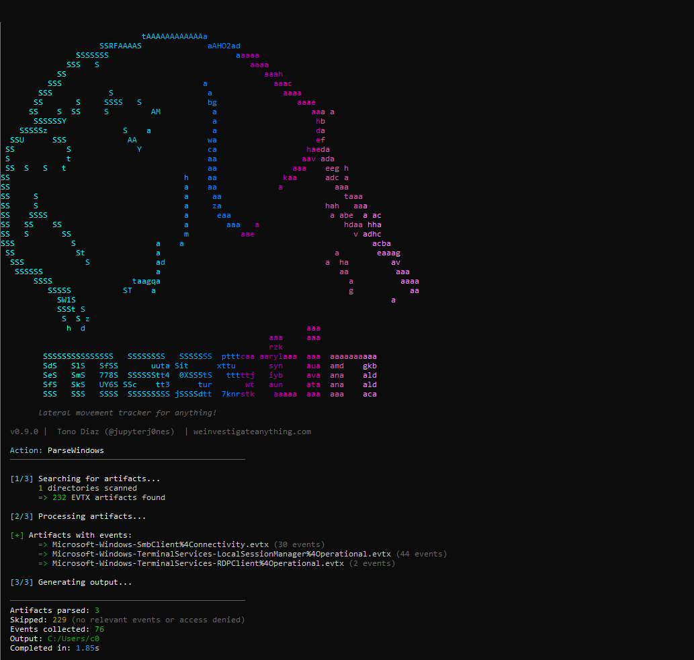
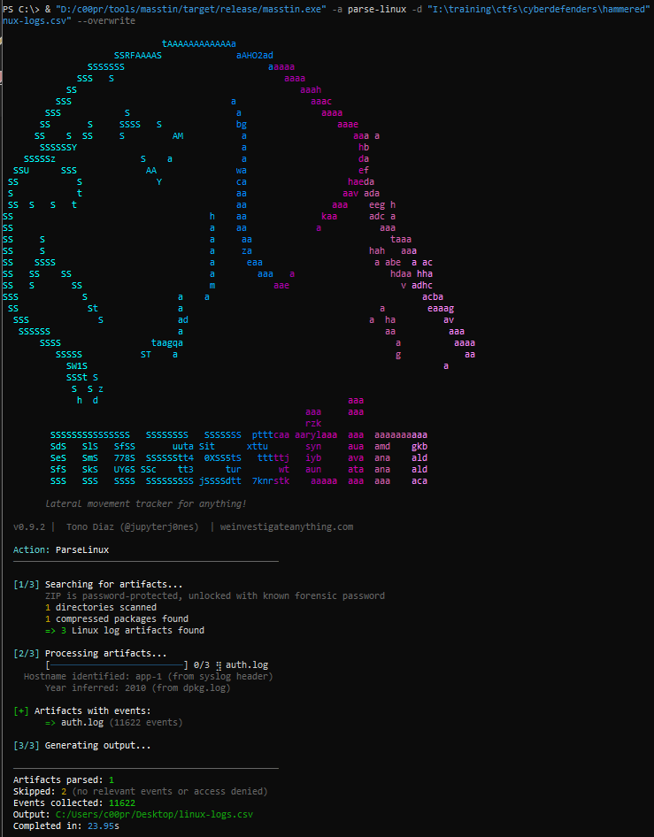
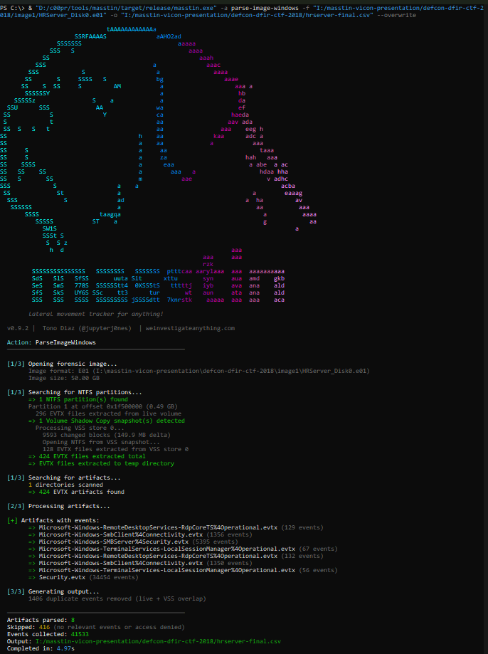

# Parsing evidence

Every `parse-*` action, what each one reads, noise filtering, triage detection, carving and merging. Back to the [README](../README.md).


## Choosing the right action — what each one actually processes

Quick reference. The three Windows actions differ by **what you feed them**, not by the parser underneath — EVTX dispatch is the same in all of them (Provider.Name routing, unknown providers silently skipped).

| Source | `parse-windows` | `parse-image` | `parse-massive` |
|---|:---:|:---:|:---:|
| Loose EVTX files and directories | ✅ | ❌ | ✅ |
| Recursive ZIP walk (unlimited nesting) | ✅ | ❌ | ✅ |
| `Provider.Name` fallback for archived / renamed EVTX | ✅ | ✅ | ✅ |
| Forensic disk images (E01, VMDK, VHD/VHDX, raw, dd, img) | ❌ | ✅ | ✅ |
| NTFS walker → `winevt/Logs` + VSS recovery | ❌ | ✅ | ✅ |
| UAL databases (`LogFiles/Sum/*.mdb`) | ❌ | ✅ | ✅ |
| Scheduled Tasks XML (`System32/Tasks/`) | ❌ | ✅ | ✅ |
| MountPoints2 (NTUSER.DAT registry hive) | ❌ | ✅ | ✅ |
| Triage detection (KAPE / Velociraptor / Cortex XDR) with per-source labels | ❌ | ❌ | ✅ |
| Loose-artifact promotion of `-d` directories into the pipeline | ❌ | ❌ | ✅ |

Rule of thumb:

- **Folder / ZIP / single EVTX** → `parse-windows`
- **Forensic image** (`.e01`, `.vmdk`, `.vhd`, `.vhdx`, `.raw`) → `parse-image`
- **Mixed evidence** (image + zip + triage + loose files) → `parse-massive`
- **Linux logs / UAC triage** → `parse-linux`; **macOS `.logarchive` or `log show` JSON** → `parse-mac`; **any other text / JSON log** → `parse-custom` with a YAML rule

In all three, any EVTX whose `Provider.Name` matches a channel masstin knows (Security-Auditing, SMBServer, SMBClient, TerminalServices-*, RdpCoreTS, WinRM, WMI-Activity) is parsed — regardless of the filename. Archived logs (`Security-YYYY-MM-DD-HH-MM-SS.evtx`), operator-renamed copies, and extracts from third-party tooling all route correctly.

## Parse Windows: Generate a lateral movement timeline

Parses Windows EVTX files and UAL databases from directories or individual files, extracting lateral movement events and merging them into a single chronological CSV. Supports compressed triage packages directly — masstin recursively decompresses and identifies all EVTX files, handling archived logs with duplicate filenames.

EVTX dispatch happens by `Provider.Name` read from the XML, not by filename, so files that do not follow the canonical Windows naming scheme — `Security-<YYYY-MM-DD-HH-MM-SS>.evtx` produced by the "Archive the log when full" retention policy, operator-renamed files, extracts from third-party tooling — are still routed to the right parser. If you want strict canonical-only matching for speed on a huge noisy tree, point `-d` directly at the `winevt/Logs` folder and the walker only opens `.evtx` and `.zip` anyway.

> **Note:** The legacy command `parse` is still supported as an alias for backwards compatibility.

```bash
# Single directory (or compressed triage package)
masstin -a parse-windows -d /evidence/logs/ -o timeline.csv

# Multiple machines
masstin -a parse-windows -d /machine1/logs -d /machine2/logs -o timeline.csv --overwrite

# Individual EVTX files
masstin -a parse-windows -f Security.evtx -f System.evtx -o timeline.csv
```

<div align="center">
  
</div>

## Parse Linux logs

Parses Linux system logs and accounting entries to extract SSH sessions and authentication events. Supports both Debian/Ubuntu (`auth.log`) and RHEL/CentOS (`secure`) log formats, with both RFC3164 (legacy syslog) and RFC5424 (structured) timestamp formats.

```bash
masstin -a parse-linux -d /evidence/var/log/ -o linux-timeline.csv

# A folder of UAC (Unix-like Artifacts Collector) triages — every tar.gz is
# detected, streamed and labelled [TRIAGE: UAC] in the per-source breakdown
masstin -a parse-linux -d /evidence/uac-collections/ -o linux-timeline.csv
```

Rotated logs are handled the way logrotate leaves them: `secure-20240616`, `messages-20260830.gz`, `wtmp-20231119`, `btmp-20260901.gz`. The `-YYYYMMDD` suffix also fixes the year of RFC3164 timestamps (which carry none), so a 2024 rotation is not stamped with the year of its 2026 siblings.

**What comes out, per source**

| Source | Events | Notes |
|---|---|---|
| `secure` / `auth.log` / `messages` (+ rotations, `.gz`) | `SSH_SUCCESS` for every `Accepted <method>` (password, publickey, keyboard-interactive/pam, gssapi-with-mic…), `SSH_FAILED` for every `Failed <method>` including `invalid user` guesses and `not allowed because` policy denials | `detail` carries the method (`ssh/publickey`, `ssh/password invalid-user`, `ssh/not-allowed`). Sources are kept whether sshd logged an IP or a resolved hostname (`UseDNS yes`). `pam_unix(sshd:auth)` failures are only used when sshd logged no outcome lines at all — on SSSD/LDAP hosts pam_unix fails for every directory user before pam_sss succeeds |
| `audit.log*` | `USER_LOGIN` / `USER_AUTH` with `addr=` → `SSH_SUCCESS` / `SSH_FAILED` | epoch timestamps; `detail` = `audit` |
| `wtmp*` / `utmp` | `LOGIN` / `LOGOUT` per session with a remote source (IP or hostname) | console sessions and boot/runlevel records are dropped |
| `btmp*` | `FAILED_LOGIN` | rotated and gzipped files included |
| `lastlog` | `LASTLOG`: last login per account with its source | uid → name via the collected `/etc/passwd`; the only trace left of accounts whose activity predates every surviving rotation |
| `/var/log/journal`, `/run/log/journal` | same sshd events as above, from journald | de-duplicated against `secure` when rsyslog's imjournal copied them there |

**Timestamps are made absolute.** RFC3164 lines are the host's local wall-clock time; masstin resolves the zone from the collected filesystem (`/etc/timezone`, `/etc/sysconfig/clock`, the `/etc/localtime` symlink target or the TZif file itself, or `timedatectl` output on a live UAC run) and converts them to UTC, so they line up with wtmp, audit and journald instead of sitting hours apart. If no zone can be found the run says so and leaves them as-is. If an archive ends early (interrupted transfer), the run prints a loud truncation warning naming the file — everything tar wrote after that point is missing.

<div align="center">
  
</div>

## Parse macOS logs

Reads the macOS Unified Log and extracts the two confirmed remote-access vectors on macOS — SSH and Screen Sharing / Apple Remote Desktop (ARD). Both carriers below feed one classifier, so the output is identical whichever you give it.

```bash
# A .logarchive bundle (sudo log collect, or exported from Console.app).
# Read directly from the binary tracev3 files — works on Windows and Linux too,
# no Mac needed.
masstin -a parse-mac -d /evidence/MACBOOK-01.logarchive -o mac-timeline.csv

# A folder that holds one or more .logarchive bundles (e.g. an unpacked triage)
masstin -a parse-mac -d /evidence/mac-triage/ -o mac-timeline.csv

# A `log show` export, for when the analyst carried the triage off as text
log show --style ndjson --info --last 30d > mac.ndjson   # run on the Mac
masstin -a parse-mac -f mac.ndjson -o mac-timeline.csv    # run anywhere
```

A `.logarchive` is a bundle of binary `tracev3` records with `dsc` / `uuidtext` string catalogues and `timesync` files. masstin parses them directly with the pure-Rust [`macos-unifiedlogs`](https://crates.io/crates/macos-unifiedlogs) crate, so an archive acquired from a Mac is parsed on any OS. A `log show --style ndjson` export (one JSON object per line) or `--style json` (a single array) needs no catalogues — the message is already resolved — and is the dependency-free path off the host.

**What comes out, per source**

| Process | Events | Notes |
|---|---|---|
| `sshd` / `sshd-session` / `sshd-auth` | `SUCCESSFUL_LOGON` for `Accepted <method>`, `FAILED_LOGON` for `Failed <method>` (including `invalid user` and `not allowed because` policy denials), `LOGOFF` for `Disconnected from user`, `CONNECT` for pre-authentication touches (banner grabs, early disconnects, including the bare `Connection closed by <ip> port <n>` and `banner exchange: ... invalid format` lines macOS writes without the `[preauth]` tag) | The OpenSSH message text is the same masstin reads on Linux; `logon_type` is `SSH`, `detail` names the method. The source address goes to `src_ip` (or `src_computer` if sshd logged a name) |
| `screensharingd` / `ScreensharingAgent` | `SUCCESSFUL_LOGON` / `FAILED_LOGON` for `Authentication: SUCCEEDED/FAILED :: User Name: <u> :: Viewer Address: <ip>` (macOS up to Ventura); on Sonoma and Sequoia, which no longer write that line, the split lines of one connection are paired per process within 5 s: a viewer address (`new viewer connection: <ip>`, `Connection accepted :: Viewer Address: <ip>`) with `authResult = 0` is a `SUCCESSFUL_LOGON` (account `uid:<n>` from the `*outUID=` line, as parse-linux does with auditd), with `authResult = 1` a `FAILED_LOGON`, and with no outcome a `CONNECT` | Covers both Screen Sharing.app and ARD screen-control sessions, which authenticate through screensharingd; `logon_type` is `ScreenSharing`. Every masstin row needs an origin: an `authResult` with no viewer address in reach (what Sonoma writes for every attempt, and Sequoia for successes) makes no row; `--debug` counts them. The account name is never logged on those versions, only the uid |

The destination of every row is the Mac being analysed; its name is taken from the `.logarchive` bundle name (a `log collect` archive is conventionally named after the host). Console logins (`loginwindow`), `sudo` and `su` are host-local, not lateral movement, and are dropped — as on every other masstin parser.

`--ignore-local` and the `--exclude-*` flags apply as on every other parser. Validated on real Sonoma 14.8 and Sequoia 15.7 bundles collected on GitHub's macOS runners (workflow `mac-evidence.yml`): the sshd lines are persisted there and parse-mac reads them from the binary bundle on any OS. An empty timeline can still be genuine: sshd writes its `Accepted` / `Failed` lines at the *info* level, a bundle collected without that level, or from a Mac that was never reached over SSH or Screen Sharing, holds only the OpenDirectory activity sshd leaves behind, which is not a logon text. Run with `--debug` to see, per bundle, how many records were scanned, how many came from `sshd` / `screensharingd` and which of those did not classify.

Not yet read (see the roadmap): `smbd` share connections (the Unified Log message format is not documented reliably enough to parse without guessing), `/var/log/system.log` / ASL text, the `utmpx` / `wtmpx` login databases, and APFS disk images.

## Parse forensic images — auto-detect Windows and Linux

**One command. Any OS. Any image format.** Masstin opens forensic disk images directly, auto-detects every partition type (NTFS or ext4), and applies the right parser to each — all without mounting, external tools, or manual OS identification.

- **NTFS partitions** → Windows parsing: EVTX + UAL from live volume + VSS snapshot recovery
- **ext4 partitions** → Linux parsing: auth.log, secure, messages, audit.log, wtmp, btmp, lastlog, and `/var/log/journal/` systemd-journald binary logs

All results are merged into a **single chronological CSV**, deduplicated across sources. This means a folder full of mixed Windows and Linux images — from a ransomware incident spanning dozens of servers — becomes a single unified timeline with one command.

Supports **E01**, **dd/raw**, **VMDK** (sparse, flat, split sparse, streamOptimized, VMFS/ESXi) and **VHD / VHDX** (fixed and dynamic; differencing disks with a parent must be merged first). Detects **BitLocker-encrypted** partitions and warns the analyst. Handles incomplete SFTP uploads (`.filepart` fallback). Pure Rust parsers for all formats. VSS recovery via [vshadow-rs](https://github.com/jupyterj0nes/vshadow-rs). [Full documentation →](https://weinvestigateanything.com/en/tools/masstin-vss-recovery/)

```bash
# Single image — auto-detects OS
masstin -a parse-image -f HRServer.e01 -o timeline.csv

# Mix Windows E01 + Linux VMDK — single merged timeline
masstin -a parse-image -f DC01.e01 -f "kali-linux.vmdk" -o timeline.csv

# Multiple images of any OS
masstin -a parse-image -f DC01.e01 -f SRV-FILE.vmdk -f ubuntu-server.e01 -o incident.csv
```

<div align="center">
  
</div>

## Bulk evidence processing — one command, entire incident

Point `-d` at a folder containing forensic images and masstin recursively scans for all E01, VMDK, VHD/VHDX and dd/raw files. Each image is opened, partitions are auto-detected (NTFS or ext4), artifacts are extracted with the appropriate parser, and everything is merged into a single chronological timeline. **No need to separate Windows and Linux images** — masstin handles it all.

```bash
# Scan an entire evidence folder — finds all images, any OS
masstin -a parse-image -d /evidence/all_machines/ -o full_timeline.csv

# Mix: evidence folder + individual images + mounted volume
masstin -a parse-image -d /evidence/ -f extra.e01 -d F: -o timeline.csv
```

Masstin automatically filters VMDK split extents (`-s001.vmdk`), snapshots (`-000001.vmdk`), flat data files (`-flat.vmdk`) and change tracking blocks (`-ctk.vmdk`), keeping only the base descriptor. For E01, only the first segment (`.E01`) is processed — subsequent segments (`.E02`, `.E03`) are loaded automatically.

## Parse massive — images + triage + loose artifacts in one pass

When you have a mix of forensic images **and** loose EVTX/log files in the same evidence folder, `parse-massive` processes everything together. It combines `parse-image` (for E01/VMDK/dd) with directory scanning (for extracted triage packages and individual EVTX files), producing a single unified timeline.

```bash
# Process all images AND loose artifacts from evidence directories
masstin -a parse-massive -d /evidence/ -o everything.csv
```

> **Difference from `parse-image`:** `parse-image` only processes forensic images found in `-d` directories. `parse-massive` also includes any loose EVTX and log files in those directories — useful when evidence arrives as a mix of disk images and extracted triage packages.

> **Backward compatibility:** The legacy commands `parse-image-windows` and `parse-image-linux` are still accepted as aliases for `parse-image`.

## Parse from mounted volumes (live disk / write-blocker)

Point masstin at a drive letter and it reads the raw volume directly — extracting all EVTX from the live filesystem and from every VSS snapshot found on the disk. No need to image the disk first. Ideal for triage or when working with a write-blocker.

```bash
# Single volume (requires Administrator on Windows)
masstin -a parse-image -d D: -o timeline.csv

# Multiple volumes
masstin -a parse-image -d D: -d E: -o timeline.csv

# Scan all NTFS volumes on the system
masstin -a parse-image --all-volumes -o timeline.csv
```

> **Note:** Reading raw volumes requires elevated privileges — run as Administrator on Windows or with `sudo` on Linux.

> **PowerShell users:** Do not end paths with `\` inside single quotes — PowerShell interprets `\` before the closing quote as an escape character, corrupting the command arguments. Masstin detects this and warns you, but the safest approach is to omit the trailing `\` or use double quotes: `-d "C:\evidence\image.vmdk"`.

## User Access Logging (UAL)

Masstin auto-detects UAL databases (`.mdb` files from `C:\Windows\System32\LogFiles\Sum`) and extracts server access records going back **up to 3 years** — surviving event log clearing and rollover. UAL records include username, source IP, role (File Server/SMB, Remote Access/RDP, etc.), access count, and first/last seen timestamps.

```bash
# Automatic: UAL is detected when scanning directories or forensic images
masstin -a parse-windows -d /evidence/Windows/System32/LogFiles/Sum/ -o timeline.csv

# Direct: point at individual .mdb files
masstin -a parse-windows -f Current.mdb -f SystemIdentity.mdb -o timeline.csv

# From forensic images: UAL databases are extracted and parsed automatically
masstin -a parse-image -f DC01.e01 -o timeline.csv
```

Each UAL record generates two timeline entries (first seen + last seen). Server hostname is resolved from `SystemIdentity.mdb`. Roles are mapped to protocols: File Server → `SMB`, Remote Access → `RDP`, Web Server → `HTTP`, etc. [Full documentation →](https://weinvestigateanything.com/en/tools/masstin-ual/)

## Parse Winlogbeat JSON

Parses Winlogbeat JSON logs forwarded to Elasticsearch. Extracts the same lateral movement data from JSON format when EVTX files are unavailable.

```bash
masstin -a parser-elastic -d /evidence/winlogbeat/ -o elastic-timeline.csv
```

## Parse Cortex XDR

Queries the Cortex XDR API directly to retrieve network connection data or EVTX forensic artifacts collected by Cortex agents.

```bash
# Network connection data
masstin -a parse-cortex --cortex-url api-xxxx.xdr.xx.paloaltonetworks.com \
  --start-time "2024-08-12 00:00:00" --end-time "2024-08-14 00:00:00" \
  -o cortex-network.csv

# EVTX forensics collected by Cortex agents
masstin -a parse-cortex-evtx-forensics --cortex-url api-xxxx.xdr.xx.paloaltonetworks.com \
  --start-time "2024-08-12 00:00:00" --end-time "2024-08-14 00:00:00" \
  -o cortex-evtx.csv
```

`parse-cortex-evtx-forensics` queries the Cortex XDR `forensics_event_log` dataset —
the backing store for Cortex's forensic triage feature, where the XDR forensic
agent collects Windows Event Logs from endpoints on demand. The same dataset also
receives logs uploaded by the Cortex XDR offline collector, so triage packages
gathered from air-gapped or unreachable hosts and pushed into the tenant are
queried through the exact same path. masstin mirrors the event IDs and extraction
logic of `parse-windows`, so output from this action merges cleanly with host-side
artifacts.

## Custom parsers (parse-custom): VPN, firewall and proxy logs via YAML rules

For any log format masstin doesn't natively support (Palo Alto GlobalProtect, Cisco AnyConnect, Fortinet SSL VPN, OpenVPN, Squid, flat JSON event exports, etc.), the `parse-custom` action reads YAML rule files that describe how to turn each line into a masstin `LogData` record. The repo ships with a library of 9 researched rules in [`rules/`](../rules/) that you can use out of the box.

```bash
# Run a single rule against a log file
masstin -a parse-custom --rules rules/vpn/palo-alto-globalprotect.yaml -f vpn.log -o timeline.csv

# Run the ENTIRE library — every log file is tried against every rule
masstin -a parse-custom --rules rules/ -f vpn.log -f firewall.log -f proxy.log -o timeline.csv

# Dry-run: show first matches + rejected samples, no CSV written
masstin -a parse-custom --rules rules/vpn/palo-alto-globalprotect.yaml -f vpn.log --dry-run

# Debug: preserve rejected lines sample alongside the output
masstin -a parse-custom --rules rules/ -f vpn.log -o timeline.csv --debug
```

The library currently covers:

| Rule | Parsers | Format |
|------|---------|--------|
| `vpn/palo-alto-globalprotect.yaml` | 5 | Palo Alto SYSTEM log subtype=globalprotect (legacy CSV syslog) |
| `vpn/cisco-anyconnect.yaml` | 4 | Cisco ASA `%ASA-6-113039/722022/722023` + `%ASA-4-113019` |
| `vpn/fortinet-ssl-vpn.yaml` | 3 | FortiGate `type=event subtype=vpn` (tunnel-up/down/ssl-login-fail) |
| `vpn/openvpn.yaml` | 4 | OpenVPN free-form syslog (Peer Connection / AUTH_FAILED / SIGTERM) |
| `firewall/palo-alto-traffic.yaml` | 2 | PAN-OS TRAFFIC log CSV — authenticated sessions (User-ID) only |
| `firewall/cisco-asa.yaml` | 6 | ASA `113004/113005/605004/605005/716001/716002` |
| `firewall/fortinet-fortigate.yaml` | 4 | FortiGate `subtype=system\|user` admin login, user auth |
| `proxy/squid.yaml` | 3 | Squid access.log CONNECT tunnel, HTTP, TCP_DENIED |
| `json/mordor.yaml` | 6 | Mordor / OTRF Security-Datasets flat NDJSON (Sysmon 3 on LM ports, 4624/4625/4634/4647/4648/5140) |

Every rule is researched against vendor official documentation and validated against realistic sample log lines committed under each category's `samples/` directory. See [`rules/README.md`](../rules/README.md) for the full references table and [`docs/custom-parsers.md`](custom-parsers.md) for the schema specification.

## Noise filtering: `--ignore-local` and `--exclude-*`

Real forensic cases often generate CSVs with 50%+ of rows that carry no useful lateral movement signal — service logons from LOCAL SYSTEM, RDP failures where the source IP was never captured, brute force attempts from noisy internal jumpboxes, and so on. Masstin ships with four opt-in flags that let you cut the output down to just the records that matter. All four are off by default, so existing workflows are not affected.

```bash
# Drop records with no usable source (loopback, service/interactive logons
# without src, LOCAL markers, MSTSC/default_value placeholders)
masstin -a parse-image -d /evidence/ -o timeline.csv --ignore-local

# Exclude known noisy service accounts and machine accounts
masstin -a parse-image -d /evidence/ -o timeline.csv --ignore-local \
    --exclude-users 'svc_*,*$,@corpsvc.txt'

# Exclude known jumpbox hostnames
masstin -a parse-image -d /evidence/ -o timeline.csv --ignore-local \
    --exclude-hosts 'JUMP01,JUMP02,*-MON,@jumpboxes.txt'

# Exclude internal subnets via CIDR
masstin -a parse-image -d /evidence/ -o timeline.csv --ignore-local \
    --exclude-ips '10.0.0.0/8,172.16.0.0/12,fe80::/10'

# Pre-flight: --dry-run with any filter shows a stats breakdown without
# writing the CSV — validate the filter composition before committing
masstin -a parse-image -d /evidence/ -o timeline.csv --ignore-local --dry-run

# Re-filter an existing CSV via merge (no re-parsing of images)
masstin -a merge -f old-timeline.csv --ignore-local --exclude-users @svc.txt \
    -o filtered.csv
```

**Filter rules**

| Flag | Drops records where... | Applies to |
|---|---|---|
| `--ignore-local` | Neither src_ip nor src_computer carries a useful value. IP useful = valid, non-loopback, non-link-local. Computer useful = non-empty, non-`-`, non-`LOCAL`, non-`MSTSC`, non-`default_value`, non-self-reference. | All parser actions |
| `--exclude-users LIST` | `subject_user_name` OR `target_user_name` matches any glob in the list (case-insensitive). | All parser actions + `merge` |
| `--exclude-hosts LIST` | `dst_computer` OR `src_computer` matches any glob. | All parser actions + `merge` |
| `--exclude-ips LIST` | `src_ip` matches any individual IP or CIDR range in the list. | All parser actions + `merge` |

**List syntax** (same for all three `--exclude-*` flags):

- **Inline CSV:** `svc_backup,svc_monitor,svc_sql`
- **File import:** `@users.txt` — one entry per line, `#` for comments
- **Mix:** `svc_foo,@bigfile.txt,admin*`
- **Glob wildcards:** `svc_*` (prefix), `*$` (suffix, matches machine accounts), `*admin*` (contains), `exact_match` (exact)
- **CIDR (ips only):** `10.0.0.0/24`, `fe80::/10`, individual IPs

**Filter summary**

After every run with any filter flag active, masstin prints a breakdown:

```
  🧹 Filter summary:
     Total records seen: 178,274
     Total kept:         110,070 (61.7%)
     Total filtered:     68,204 (38.3%)

     --ignore-local:     68,204 (38.3%)
        both_noise             67,703
        self_reference            134
        service_logon             306
        interactive_logon          21
        literal_LOCAL              39
        loopback_ip                 1
     --exclude-users:       523 (0.3%)   [3 patterns]
     --exclude-hosts:       245 (0.1%)   [2 patterns]
     --exclude-ips:          12 (0.0%)   [1 ranges]
```

The stats always attribute each filtered record to exactly one cause (the first filter layer that matched), so the numbers add up. Use `--dry-run` to see this report without writing the CSV.

**Safety guarantee:** records with a valid routable public `src_ip` are never filtered by `--ignore-local`, regardless of what `src_computer` contains. This preserves brute force and external attack signal even when Windows couldn't resolve a workstation name — the most common missing-metadata case in real forensics.

## Triage detection and per-source breakdown

When the directory walker encounters a ZIP archive (or, in `parse-linux`, a `.tar` / `.tar.gz` / `.tgz`), masstin reads its entry list and runs pattern matching against four known triage tool layouts. Detected packages surface as `=> Triage found:` lines in phase 1 and drive the per-source grouping in phase 2 — so the analyst can tell at a glance which events came from which source.

Archives nest freely: a zip wrapping two UAC tarballs, or a tar.gz wrapping another tar.gz, is walked all the way down and every level is labelled with its full chain (`outer.tar.gz -> inner/uac-host-linux-20260924230926.tar.gz`). Tar archives are streamed and only the files masstin can use are unpacked, so a multi-GB UAC collection costs seconds and a few MB of temp space, not a full extraction.

**Detection signatures**

| Triage tool | Marker (any of) | Hostname extracted from |
|---|---|---|
| **KAPE** | `_kape.cli` at any level, `Console/KAPE.log`, or 5+ entries matching `<host>/C/Windows/System32/winevt/Logs/*.evtx` | Filename pattern `<host>_<digits>...zip` (only when the shape is unambiguous; KAPE has no enforced filename) |
| **Velociraptor Offline Collector** | Top-level `client_info.json` + (`collection_context.json` OR `uploads.json`); encrypted variant uses `metadata.json` + `data.zip` | Filename pattern `Collection-<host>-<YYYY-MM-DD>T...Z.zip` |
| **Cortex XDR Offline Collector** | Any entry ending in `cortex-xdr-payload.log` (this filename is unique to the XDR collector) | Filename pattern `offline_collector_output_<host>_<YYYY-MM-DD>_<HH-MM-SS>.zip` |
| **UAC (Unix-like Artifacts Collector)** | `uac.log` at the archive root plus the `[root]/` or `live_response/` layout directory (tar.gz by default, zip with `-f zip`); or the enforced filename `uac-<host>-<os>-<YYYYMMDDhhmmss>` | Filename pattern `uac-<host>-<os>-<YYYYMMDDhhmmss>.tar.gz`. UAC writes `unknown` when it was run against a mounted image, so masstin then falls back to `[root]/etc/hostname`, `/etc/sysconfig/network`, `uac.log`, `/etc/hosts` and the syslog header of the collected logs |

**Phase 1 output** (folder containing 2 triages plus a forensic image with NTUSER.DAT hives). Notice that every counter — triages, EVTX inside compressed archives, MountPoints2 from registry, Scheduled Tasks from XML — appears as `=>` lines INSIDE the same `[1/3]` block, not scattered before/after the phase header:

```
[1/3] Searching for artifacts...
        => Triage found: Velociraptor Offline Collector [host: WIN-DC01]
           source: K:/CEN26-1164N-B/SFTP/triages/Collection-WIN-DC01-2026-04-13T15_30_00Z.zip
           entries inside: 247 (EVTX or other matched files)
        => Triage found: Cortex XDR Offline Collector [host: TESTHOST01]
           source: K:/CEN26-1164N-B/SFTP/triages/offline_collector_output_TESTHOST01_2026-04-13_15-30-00.zip
           entries inside: 173 (EVTX or other matched files)
        420 EVTX artifacts found inside 2 of 2 compressed archives
        => 432 EVTX artifacts found total
        => 12 MountPoints2 remote share events found
        => 13 remote Scheduled Task events found
```

The `source:` line under each triage shows the **full path** to the zip — critical because real cases often have duplicate copies of the same host's triage in different folders (e.g. one in `SFTP/...` and another in `To-Unit42/...`). Showing only the filename would make them look identical even though they're physically different files.

**Phase 2 output** — every artifact is grouped by SOURCE (image, triage, archive, or loose folder), each group showing the total event count plus the per-EVTX list. **VSS-recovered events are tagged inline** so the analyst can tell at a glance which logs came from a shadow copy vs which came from the live partition:

```
[+] Lateral movement events grouped by source (4 sources):

        => [IMAGE]  HRServer_Disk0.e01  (4521 events total)
           - Security.evtx (3220)
           - Microsoft-Windows-TerminalServices-LocalSessionManager%4Operational.evtx (134)
           - Security.evtx (1095)  [VSS]
           - Microsoft-Windows-TerminalServices-LocalSessionManager%4Operational.evtx (72)  [VSS]

        => [TRIAGE: Cortex XDR]  triages/offline_collector_output_TESTHOST01_2026-04-13_15-30-00.zip  [host: TESTHOST01]  (834 events total)
           - Security.evtx (612)
           - Microsoft-Windows-WinRM%4Operational.evtx (89)
           - Microsoft-Windows-TerminalServices-LocalSessionManager%4Operational.evtx (133)

        => [TRIAGE: Velociraptor]  triages/Collection-WIN-DC01-2026-04-13T15_30_00Z.zip  [host: WIN-DC01]  (4521 events total)
           - Security.evtx (4380)
           - Microsoft-Windows-WinRM%4Operational.evtx (141)

        => [FOLDER]  D:/evidence/loose/extracted_evtx  (131 events total)
           - Security.evtx (120)
           - Microsoft-Windows-TerminalServices-LocalSessionManager%4Operational.evtx (11)
```

**VSS tagging** is automatic — the helper detects `partition_<N>_vss_<M>/` paths in the temp extraction tree and labels matching entries with a `[VSS]` suffix (or `[VSS-0]`, `[VSS-1]` when multiple snapshots from the same image coexist, so each one stays visually distinct). Live entries carry no annotation. Within each source group, items are sorted **live-first then by VSS index**, so the analyst reads "what the system has now" at the top and "what masstin recovered from snapshots" underneath as a clearly demarcated bonus section. This is exactly the forensic story masstin's VSS recovery feature is supposed to tell.

**Triage source labels** include the **immediate parent directory** of the zip (`triages/<filename>` above) so two physical copies of the same host's triage living in different folders (e.g. `SFTP/host.zip` vs `To-Unit42/host.zip`) appear as DIFFERENT source groups instead of collapsing into one bucket with duplicated entries inside.

**Source tags** are ASCII only — no emoji — so they render correctly in conhost legacy on Windows Server 2016/2019, RDP sessions, mosh/tmux, and any analyst environment regardless of fonts or terminal capabilities. Each tag is colour-coded for visual distinction:

- `[IMAGE]` — cyan — forensic image extract (works for E01, VMDK, dd, all formats)
- `[TRIAGE: <type>]` — yellow — detected triage package, with hostname and parent-directory hint
- `[ARCHIVE]` — white — ZIP that doesn't match any known triage layout
- `[FOLDER]` — dim — loose artifacts in a regular directory, identified by their full parent path (not just the leaf name)
- `[VSS]` / `[VSS-N]` suffix — yellow — appended to individual EVTX entries within an `[IMAGE]` group when they were recovered from a Volume Shadow Copy

This applies to **every parser action** that walks directories: `parse-windows`, `parse-image`, `parse-massive`, `parse-linux`. The same source labels show up regardless of which action you ran, so the breakdown format is consistent across the whole tool.

After the summary, the action prints a **load-into-graph hint** with both Memgraph and Neo4j commands ready to copy-paste, with the output path canonicalised to the long form (no 8.3 short names like `C00PR~1.DES` leaking into the suggestion):

```
        Load into graph (pick one):
          Memgraph:  masstin -a load-memgraph -f C:/cases/.../timeline.csv --database localhost:7687
          Neo4j:     masstin -a load-neo4j   -f C:/cases/.../timeline.csv --database bolt://localhost:7687 --user neo4j
```

## EVTX carving: last-resort recovery from unallocated space

When the attacker cleared the logs, wiped VSS, and deleted the UAL databases, there's still one place where event data can survive: the unallocated space of the disk itself. `carve-image` scans the raw image looking for 64 KB EVTX chunks (`ElfChnk\x00` magic), validates them, groups them by provider, builds synthetic EVTX files, and feeds them through the normal masstin pipeline.

```bash
# Carve a single image
masstin -a carve-image -f server.e01 -o carved.csv

# Carve multiple images at once
masstin -a carve-image -f DC01.e01 -f SRV-FILE.vmdk -o carved.csv

# Skip known-bad offsets on a pathological E01 (corrupted EWF chunks)
masstin -a carve-image -f broken.e01 --skip-offsets 0x6478b6000 -o carved.csv

# Keep rejected synthetic EVTX files for post-mortem / upstream bug reports
masstin -a carve-image -f image.e01 -o carved.csv --debug
```

**What it implements today:**
- **Tier 1 — full chunk recovery**: complete 64 KB chunks recovered from unallocated space, parsed with full fidelity through the regular pipeline. Events are indistinguishable from live ones in the output.
- **Tier 2 — orphan record detection**: individual records outside recoverable chunks are counted and reported (header metadata only; full XML reconstruction is Tier 3).
- **Tier 3 — template matching**: planned. Will reconstruct XML from orphan records using templates harvested from Tier 1 chunks plus a common Windows template library.

**Hardened against a hostile ecosystem**: the upstream `evtx` crate was designed to parse well-formed live logs, not arbitrary corrupted 64 KB buffers from unallocated space. We found three classes of bugs during development (infinite loop on malformed BinXML and two unbounded multi-GB allocations that aborted the whole process), [reported them upstream](https://github.com/omerbenamram/evtx/issues/290), and they were fixed in evtx 0.11.2. A fourth path — a `Vec::with_capacity(~16 GiB)` inside `read_template_values_cursor` driven by a corrupt BinXML template-values count — still aborts the process on evtx 0.11.2 because the Rust allocator resolves OOM with `abort()` (not a panic), so `catch_unwind` and thread isolation cannot contain it.

To survive that without blocking on an upstream fix, the phase-2 validator spawns a **child process per synthetic EVTX** via `MASSTIN_VALIDATE_EVTX=<path>`, which runs `masstin::validate_evtx_file` and exits 0 on success. If the child aborts by OOM the parent sees a non-zero exit code (Windows `0xC0000409`, Linux signal), rejects the offending file, and keeps carving. Verified end-to-end on a 50 GB `ws01-wipe-novss.raw`: one pathological chunk used to kill the entire run; now it gets quarantined as `masstin_rejected_evtx/panic_oom__Security.evtx` while the remaining 107 synthetic files parse cleanly.

Defenses kept on top of the subprocess boundary:

- `std::panic::catch_unwind` inside the child for any ordinary panic path in malformed BinXML
- 60-second wall-clock poll deadline on the child; hangs are killed and the file is rejected
- `--skip-offsets` lets you tell masstin to jump over a 32 MB window around a problematic E01 offset on re-runs
- `--debug` preserves rejected synthetic EVTX files to `<output_dir>/masstin_rejected_evtx/` for post-mortem

Full technical breakdown: [EVTX carving article](https://weinvestigateanything.com/en/tools/evtx-carving-unallocated/).

## Merge: Combine multiple timelines

```bash
masstin -a merge -f timeline1.csv -f timeline2.csv -o merged.csv
```


## Supported artifacts at a glance
Masstin parses **33+ Windows Event IDs** across **12 EVTX sources**, plus Linux artifacts, UAL databases, Winlogbeat JSON, and Cortex XDR. For a full breakdown, see [ARTIFACTS.md](../ARTIFACTS.md).

## Windows EVTX

| Source | Event IDs | What it tracks | Article |
|--------|-----------|---------------|---------|
| **Security.evtx** | 4624, 4625, 4634, 4647, 4648, 4768, 4769, 4770, 4771, 4776, 4778, 4779, 5140 | Logons, logoffs, Kerberos, NTLM, RDP reconnect, share access | [Read more →](https://weinvestigateanything.com/en/artifacts/security-evtx-lateral-movement/) |
| **TerminalServices-LocalSessionManager** | 21, 22, 24, 25 | RDP session lifecycle | [Read more →](https://weinvestigateanything.com/en/artifacts/terminal-services-evtx/) |
| **TerminalServices-RDPClient** | 1024, 1102 | Outgoing RDP connections | [Read more →](https://weinvestigateanything.com/en/artifacts/terminal-services-evtx/) |
| **TerminalServices-RemoteConnectionManager** | 1149 | Incoming RDP accepted | [Read more →](https://weinvestigateanything.com/en/artifacts/terminal-services-evtx/) |
| **RdpCoreTS** | 131 | RDP transport negotiation | [Read more →](https://weinvestigateanything.com/en/artifacts/terminal-services-evtx/) |
| **SMBServer/Security** | 1009, 551 | SMB server connections and auth | [Read more →](https://weinvestigateanything.com/en/artifacts/smb-evtx-events/) |
| **SMBClient/Security** | 31001 | SMB client share access | [Read more →](https://weinvestigateanything.com/en/artifacts/smb-evtx-events/) |
| **SMBClient/Connectivity** | 30803-30808 | SMB connectivity and share events | [Read more →](https://weinvestigateanything.com/en/artifacts/smb-evtx-events/) |
| **WinRM/Operational** | 6 | PowerShell Remoting session init — destination host from connection field (source system) | [Read more →](https://weinvestigateanything.com/en/artifacts/winrm-wmi-schtasks-lateral-movement/) |
| **WMI-Activity/Operational** | 5858 | Remote WMI execution — source machine from ClientMachine field (destination system) | [Read more →](https://weinvestigateanything.com/en/artifacts/winrm-wmi-schtasks-lateral-movement/) |
| **Sysmon/Operational** | 3 | Network connections on lateral-movement service ports (22, 135, 139, 445, 1433, 3306, 3389, 5900, 5985, 5986); direction from `Initiated`, initiating process in `detail` | |
| **Scheduled Tasks XML** | — | Remotely registered tasks detected via Author field (MACHINE\user) | [Read more →](https://weinvestigateanything.com/en/artifacts/winrm-wmi-schtasks-lateral-movement/) |
| **MountPoints2 (NTUSER.DAT)** | — | Remote share connections from each user's registry (##SERVER#SHARE with LastWriteTime) | [Read more →](https://weinvestigateanything.com/en/artifacts/mountpoints2-lateral-movement/) |

## UAL (User Access Logging)

| Source | What it tracks | Article |
|--------|---------------|---------|
| `SystemIdentity.mdb` | Server hostname, role mappings | [Read more →](https://weinvestigateanything.com/en/tools/masstin-ual/) |
| `Current.mdb` + `{GUID}.mdb` | Username, source IP, role, access count, first/last seen (up to 3 years) | [Read more →](https://weinvestigateanything.com/en/tools/masstin-ual/) |

## Linux

| Source | What it tracks | Article |
|--------|---------------|---------|
| `/var/log/auth.log` (Debian/Ubuntu) | SSH success, failure, PAM authentication | [Read more →](https://weinvestigateanything.com/en/artifacts/linux-forensic-artifacts/) |
| `/var/log/secure` (RHEL/CentOS) | SSH success, failure, PAM authentication | [Read more →](https://weinvestigateanything.com/en/artifacts/linux-forensic-artifacts/) |
| `/var/log/messages` | SSH events via syslog | [Read more →](https://weinvestigateanything.com/en/artifacts/linux-forensic-artifacts/) |
| `/var/log/audit/audit.log` | `USER_LOGIN` / `USER_AUTH` from auditd — primary SSH signal on Ubuntu + SSSD | [Read more →](https://weinvestigateanything.com/en/artifacts/linux-forensic-artifacts/) |
| `/var/log/journal/<machine-id>/*.journal[~]` | systemd-journald binary logs — sshd `Accepted`/`Failed` events on modern SSSD / AD hosts | [Read more →](https://weinvestigateanything.com/en/artifacts/linux-forensic-artifacts/) |
| `utmp` / `wtmp` / `btmp` / `lastlog` | Login sessions, failed attempts | [Read more →](https://weinvestigateanything.com/en/artifacts/linux-forensic-artifacts/) |

## macOS

| Source | What it tracks | Notes |
|--------|---------------|-------|
| `.logarchive` (Unified Log, binary `tracev3`) | `sshd` SSH logons and `screensharingd` Screen Sharing / ARD logons — success, failure, policy denial, pre-auth contact, disconnect | Read directly on any OS via `macos-unifiedlogs`; `sudo log collect` output or a Console.app export |
| `log show --style ndjson` / `json` export | Same `sshd` and `screensharingd` events | Dependency-free text carrier, resolved off the host |

## Winlogbeat & Cortex XDR

| Source | What it tracks | Article |
|--------|---------------|---------|
| Winlogbeat JSON | All Windows Event IDs in JSON format | [Read more →](https://weinvestigateanything.com/en/artifacts/winlogbeat-elastic-artifacts/) |
| Cortex XDR Network | RDP, SMB, SSH connections via API | [Read more →](https://weinvestigateanything.com/en/artifacts/cortex-xdr-artifacts/) |
| Cortex XDR EVTX Forensics | Forensic event logs from agents | [Read more →](https://weinvestigateanything.com/en/artifacts/cortex-xdr-artifacts/) |
